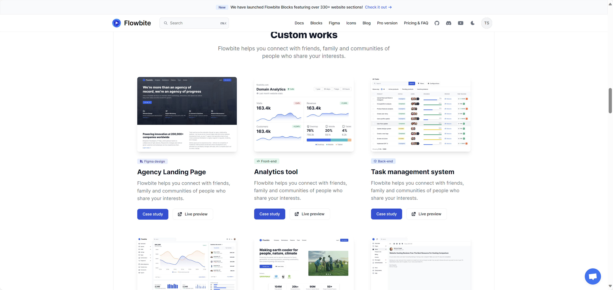

# Testing Notion formatting {#1e41d5806e3c44ee930a5183465a41f3}


## Heading 2 {#4f080274d2784ae99056dea52a52d03f}


### Heading 3 {#c6dba18e8521478eb4d4d4785adf8277}


:::caution

Callout


:::


```powershell
# PowerShell

$DisabledDelveUsers = Get-EXORecipient -ResultSize 50000 -Filter "CustomAttribute3 -like '*delve_disabled*'"

$DisabledDelveUsers | foreach-object{

    $Null = Add-AzTableRow -Table $TableObject -RowKey $_.ExternalDirectoryObjectId -PartitionKey 'DisableDelve' -property @{DelveDisabled = $true; PrimarySmtpAddress = $_.PrimarySmtpAddress } 

    }
```


Column 2





Column 1

