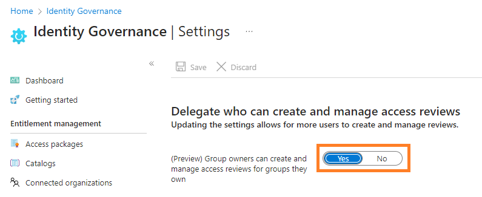

Test copy from ourcloudnetwork.com


Access Reviews in Microsoft Entra provide a way to continuously review access to resources in your tenant. More importantly, you as the owner of your tenant can enable resource owners (of groups or Teams) to govern external users’ access to said resources themselves, thus reducing your workload and shifting the responsibility.


Many organisations rely on the collaboration features available in Microsoft 365, like Microsoft Teams, to work with external organisations on projects. A convenient way of doing this is by inviting said external users as guests to your organisation, this comes with its governance challenges, which Access reviews will solve.


# **Enable group owners to manage access reviews** {#c1ffd71921ef45a9bf4464c96a1dda8f}


Access reviews for group owners are disabled by default. To enable this feature, log in to your Microsoft Entra tenant as a Global Administrator and follow the below steps:

1. Expand **Identity Governance** and select **Access reviews**.
2. Select **Settings**, then enable **Group owners can create and manage access reviews for groups they own**.

	


# **Enable Group owner access reviews with Microsoft Graph PowerShell** {#46f9fb90af52450191c5d00fb097fb63}


You can also enable this feature using Microsoft Graph PowerShell.


_(For steps on installing the Microsoft Graph PowerShell SDK, check out my post_ [_here_](https://ourcloudnetwork.com/how-to-install-the-microsoft-graph-powershell-sdk/)_.)_


```powershell
Connect-MgGraph -scopes Policy.ReadWrite.AccessReview

$params = @{
	isGroupOwnerManagementEnabled = $true
}

Update-MgBetaPolicyAccessReviewPolicy -BodyParameter $params
```


# **Create a new access review as a group owner** {#f461ccd402454a1eb99f40dfdbc6d0d3}


Any user who is the owner of a group will now be able to create access reviews for groups they own through the Microsoft Entra admin center. Follow the below steps to create a new access review.

1. While signed in to your standard user account (without any roles) open the [Identity Governance Access Reviews blade](https://entra.microsoft.com/#view/Microsoft_AAD_ERM/DashboardBlade/~/Controls).
2. Click **New access review**.

	

3. On the **Review type** page, you will only have the option to set the **Review scope** to **Select Teams + groups**. Click **Select groups** and you will see only the groups you own, choose your target group and click **Select**.

	

4. In our scenario, I am going to create a single-stage review for the group owners to conduct. On the Reviews page, you will have the option to select specific reviewers.

	I suggest you select **Group owners as the reviewer**. Then create a **fallback reviewers group with appointed users**. If a groups owners no longer exist (they leave the organisation for example), the fallback reviewers will be alerted of the review and can continue to maintain governance over the group.


	You should also select the duration, recurrence and end date of the review, here are my recommendations:

	- **Duration:** 2 days
	- **Review recurrence:** Monthly
	- **End date:** Never

	_**When managing guest users, there should never be a time when their access to your data is not being governed or reviewed. Of course, change these settings to as you prefer, but ensure the end date is set to never when reviewing guest users.**_


	

5. The **Upon completion settings** allow you to define important settings around automatic remediation.
	- **Auto-apply results to resource:** If the user’s access is denied, their access to the resource will be removed automatically after the review is completed, otherwise manual remediation is required.
	- **If reviewers don’t respond:** I have chosen **No change**, however, for the most governance, I recommend selecting **Remove Access**. All options include:
		- No change
		- Remove access
		- Approve access
		- Take recommendation
	- **Action to apply on denied guest users:**
		- Remove the user’s membership from the resource
		- Block the user from signing in for 30 days, then remove the user from the tenant.
	- **At end of review, send notification to:** Sends a notification to specific users.

		

6. For the remaining options on the settings page, while they do not impact the outcome, they enable you to review notifications and reminders for the review and also provide helpful information such as the last sign-in date for the guest user. This will help you decide on whether to remove access or not.

	

7. Click **Review + create**, then define a review name and click **Create**.

# **Completing the Access Review** {#906dce5363d44650b5e1c05387a384df}


When the access review begins (as defined by the start date within the review settings), the reviewer of the group will receive a notification email with a link to start the review.


The link will take them to the Access reviews blade within [https://myaccess.microsoft.com/.](https://myaccess.microsoft.com/) You can also navigate directly to that link and then select the name of the access review you want to begin.


As you can see, Entra is recommending that because the user has been inactive in the tenant for over 30 days, it should be denied access to the resource.


Once access is denied, it will show as denied in the list. This action can be reversed if an incorrect decision is made.


# **Impact of denying access in an Access review** {#ec9dc88ec5a94ab2ad359f5b871071fd}


Once the reviewer has actioned the review and denied the guest access to the resource, once the review is complete, the guest access will be removed from the resource.


This only happens once the duration period is finished and not instantly. For example, if the review duration is 2 days and you deny access on the first day, the guest will still have access for anther day, before their access is removed.


# **Wrapping up** {#5f3024b894ef406ab7f224f1b8026cba}


Access reviews are a powerful tool to ensure that guest users in your tenant do not retain access to resources for longer than they need. In this post, I have demonstrated how to can delegate permission to create access reviews to the owner of groups and hence collaborative resources in your tenant.


This ensures guest users are governed in larger organisations where it would not be feasible for a single team to manage them and maintain responsibility for them.

