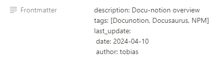

### Docs / Blog workflow {#b0c1174de8314b718964b107f5a5e7ab}


GitHub Actions:


```json
    "pulldocs": "cross-var docu-notion -n %DOCU_NOTION_INTEGRATION_TOKEN% -r %DOCU_NOTION_DOCS_PAGE% -t \\"*\\" -m \\"./docs\\"",
    "pullblog": "cross-var docu-notion -n %DOCU_NOTION_INTEGRATION_TOKEN% -r %DOCU_NOTION_BLOG_PAGE% -t \\"*\\" -m \\"./blog\\""

```

- A single Notion connection is used for the entire Workspace
- The workspace includes a database and two root pages for documents and blog


- To pull only the documents or blog structure, we use the page id of KB and Blog in the GitHub Action
- We do not check the database status info of a page
- We utilize the statuses to differentiate the pages between blog and documents

	


### Modifications {#3df06882f0de4358adf0dcf174a1b559}


We've introduced the Notion multiline string property **Frontmatter.**





The string is added to the notionFrontmatterProperties.


This way, we're able to use any Frontmatter in docu-notion


Below are the changes we implemented:

- [src/transform.ts](https://github.com/sillsdev/docu-notion/compare/main...JustInnIO:docu-notion:main#diff-adb065f7ea26f7f005649ad48bcbf0534bc860c701bb4e19c3917b125f4e2f20)

	```typescript
	  if (page.frontmatter) {
	    const notionFrontmatter = page.frontmatter;
	
	    const notionFromtmatterProperties = notionFrontmatter.split("\\n");
	
	    notionFromtmatterProperties.forEach(property => {
	      frontmatter += `${property}\\n`;
	    });
	  }
	
	```

- [src/NotionPage.ts](https://github.com/sillsdev/docu-notion/compare/main...JustInnIO:docu-notion:main#diff-240264b397a110805a81bbfc81e6fabc2ff9702703ffdf0c6d1af84edbb05622)

	```typescript
	  public get frontmatter(): string | undefined {
	    return this.getPlainTextProperty("Frontmatter", "");
	  }
	
	```


### NPM {#e4ac538cdbcf463bbe1fb5262c10d35c}


#### Overview {#a017adf1c16f433f8952a08910861ee1}

- The package is available on [npmjs.com](http://npmjs.com/) [https://www.npmjs.com/package/@justinnio/docu-notion](https://www.npmjs.com/package/@justinnio/docu-notion)

#### Updating process {#e15e4a9fc5984b789f55deba696cdcc8}


```powershell
# Install dependencies
npm i

# Update version number in docu-notion
# File: <https://github.com/JustInnIO/docu-notion/blob/main/package.json>

# Execute build
npm run build

# Sign In to NPMjs.com
npm adduser

# NPM Publish new version
npm publish

# Update the version number for the website
# File: <https://github.com/JustInnIO/website/blob/master/package.json>

```


### Notion API Info {#3c4c2a6a312a40c3ab40c488df19e22e}


docu-notion utilizes [docu-notion/src/pull.ts at main · sillsdev/docu-notion (github.com)](https://github.com/sillsdev/docu-notion/blob/main/src/pull.ts) to pull pages from Notion. The logic can be altered.


With the following function, we locate pages in Notion:


`await notionClient.pages.retrieve({ page_id: options.rootPage` });


The GET function is detailed here:


[https://developers.notion.com/reference/retrieve-a-page](https://developers.notion.com/reference/retrieve-a-page)


It is possible to add a filter property:


The filter is defined in the body.


**Example**


```json
{
  "and": [
    {
      "property": "Approved",
      "checkbox": {
        "equals": true
      }
    },
    {
      "property": "Episodes",
      "select": {
        "equals": "React"
      }
    }
  ]
}
```

