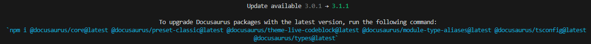

### Install {#2eafeda96ec54b51a28ac43f90334e3e}

1. Install Node..js from [https://nodejs.org/en/download/](https://nodejs.org/en/download/)
2. Change to the directory where the Docusaurus instance should be
3. run npx create-docusaurus@latest, set instance name and template (classic)
4. How to Azure Staic WebApp
[#11: Share Content with Docusaurus & Azure Static Web Apps - DEV Community](https://dev.to/azure/11-share-content-with-docusaurus-azure-static-web-apps-30hc)
5. Run `npx create-docusaurus@latest website-justinn classic --typescript`

### Run {#3e342a47361545b9bf8777815eb528c4}

1. For EN und DE support:
`npm run build && npm run serve`
2. Build  `npm run build`
3. Build and start `npm run start`
4. Start `npm run serve`
5. Build `npm run docusaurus build`
6. Build and start `npm docusaurus start`

### Update {#e786ca280b004a2ea6d600d1cfa38de3}

Get update command by using `npx docusaurus --version`, if there is a newer version it will be provide the command:

Example:
`npm i @docusaurus/core@latest @docusaurus/preset-classic@latest @docusaurus/theme-live-codeblock@latest @docusaurus/module-type-aliases@latest @docusaurus/tsconfig@lates`

