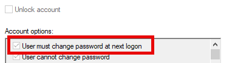
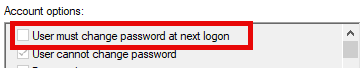

### Troubleshooting {#196fa6da3fef80fe8070e92f791174ed}


#### Passwords not available but Password Hash Sync enabled {#196fa6da3fef807b8f5cee6ce00f53d8}


**Sync per user**


I had the issue that in a Password Hash Sync enabled environment that the passwords were not synced to Entra Domain Services:





Entra Connect didn’t show any issues with the Troubleshooting PowerShell cmdlets.


The workaround I found is to use the PowerShell cmdlet `Invoke-ADSyncCSObjectPasswordHashSync` for all synced users.


```powershell
 # Define the OU path to search for users
$ouPath = "OU=OU,DC=configforge,DC=local"

# Specify the connector name
# Normally the source domain name, e.g. configforge.local
$connectorName = "configforge.local"

# Get all users in the specified OU
# Change the filter to be more selective
$users = Get-ADUser -Filter * -SearchBase $ouPath

# Iterate through each user and sync their password hash
foreach ($user in $users) {
    try {
        # Sync the password hash for the current user
        Invoke-ADSyncCSObjectPasswordHashSync -DistinguishedName $user.DistinguishedName -ConnectorName $connectorName
        
        # Output success message
        Write-Host "Password hash synced for user: $($user.SamAccountName)"
    }
    catch {
        # Output error message if the sync fails
        Write-Host "Failed to sync password hash for user: $($user.SamAccountName). Error: $_"
    }
} 

```


After manual sync:





**Sync all**


Following the instructions from MS on [https://learn.microsoft.com/en-us/entra/identity/domain-services/tutorial-configure-password-hash-sync#enable-synchronization-of-password-hashes](https://learn.microsoft.com/en-us/entra/identity/domain-services/tutorial-configure-password-hash-sync#enable-synchronization-of-password-hashes) we can also enforce a password hash sync like this:


```powershell
# Run on Entra Connect server

# Define the Azure AD Connect connector names and import the required PowerShell module
# Get names with Get-ADSyncConnector
$azureadConnector = "<CASE SENSITIVE AZURE AD CONNECTOR NAME>"
$adConnector = "<CASE SENSITIVE AD DS CONNECTOR NAME>"

Import-Module "C:\Program Files\Microsoft Azure AD Sync\Bin\ADSync\ADSync.psd1"
Import-Module "C:\Program Files\Microsoft Azure Active Directory Connect\AdSyncConfig\AdSyncConfig.psm1"

# Create a new ForceFullPasswordSync configuration parameter object then
# update the existing connector with this new configuration
$c = Get-ADSyncConnector -Name $adConnector
$p = New-Object Microsoft.IdentityManagement.PowerShell.ObjectModel.ConfigurationParameter "Microsoft.Synchronize.ForceFullPasswordSync", String, ConnectorGlobal, $null, $null, $null
$p.Value = 1
$c.GlobalParameters.Remove($p.Name)
$c.GlobalParameters.Add($p)
$c = Add-ADSyncConnector -Connector $c

# Disable and re-enable Azure AD Connect to force a full password synchronization
Set-ADSyncAADPasswordSyncConfiguration -SourceConnector $adConnector -TargetConnector $azureadConnector -Enable $false
Set-ADSyncAADPasswordSyncConfiguration -SourceConnector $adConnector -TargetConnector $azureadConnector -Enable $true
```

