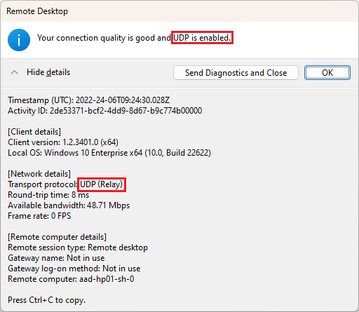
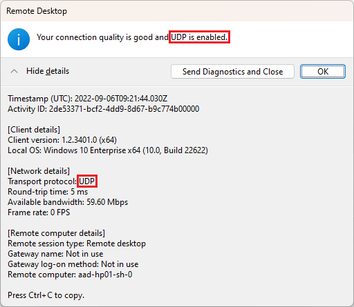

### Planning {#1fdd4c4fef674aa888b97df6e80fc687}


#### Network requirements: {#a090dfcdf5834466867d9bc2773a57e3}


- [Remote Desktop Protocol bandwidth requirements Azure Virtual Desktop - Azure | Microsoft Learn](https://learn.microsoft.com/en-us/azure/virtual-desktop/rdp-bandwidth)
- [Azure Virtual Desktop Experience Estimator | Microsoft Azure](https://azure.microsoft.com/en-us/products/virtual-desktop/assessment/#estimation-tool)
- [https://www.azurespeed.com/](https://www.azurespeed.com/)


**Questions:**


- How many clients do I have?
- How many hours per day on average?
- What's the region for the end-users location?
	- AVD Experience Estimator


#### Prerequisites {#eaa86995c6d241e38133c37e3658b4eb}


[Prerequisites for Azure Virtual Desktop | Microsoft Learn](https://learn.microsoft.com/en-us/azure/virtual-desktop/prerequisites?tabs=portal)

1. Required URL List [Required URLs for Azure Virtual Desktop | Microsoft Learn](https://learn.microsoft.com/en-us/azure/virtual-desktop/safe-url-list?tabs=azure)
2. Required URL Check [Use the Required URL Check tool for Azure Virtual Desktop | Microsoft Learn](https://learn.microsoft.com/en-us/azure/virtual-desktop/required-url-check-tool)

#### Identity Services {#0bb3bac3ba8549e2a2077013f5702561}


**AD vs ADDS vs Entra ID**


The following table summarizes identity scenarios that Azure Virtual Desktop currently supports:


| Identity scenario              | Session hosts         | User accounts                             |
| ------------------------------ | --------------------- | ----------------------------------------- |
| Azure AD + AD DS               | Joined to AD DS       | In Azure AD and AD DS, synchronized       |
| Azure AD + AD DS               | Joined to Azure AD    | In Azure AD and AD DS, synchronized       |
| Azure AD + Azure AD DS         | Joined to Azure AD DS | In Azure AD and Azure AD DS, synchronized |
| Azure AD + Azure AD DS + AD DS | Joined to Azure AD DS | In Azure AD and AD DS, synchronized       |
| Azure AD + Azure AD DS         | Joined to Azure AD    | In Azure AD and Azure AD DS, synchronized |
| Azure AD only                  | Joined to Azure AD    | In Azure AD                               |


**Is ADDS needed for AVD?**

- Yes, if active directory is needed online
- No, if Azure AD Join standalone can be used

**Azure AD Joined devices notes**


[https://learn.microsoft.com/en-us/azure/virtual-desktop/azure-ad-joined-session-hosts#known-limitations](https://learn.microsoft.com/en-us/azure/virtual-desktop/azure-ad-joined-session-hosts#known-limitations)


- Azure Virtual Desktop (classic) doesn't support Azure AD-joined VMs.
- Azure AD-joined VMs don't currently support external identities, such as Azure AD Business-to-Business (B2B) and Azure AD Business-to-Consumer (B2C).
- Azure AD-joined VMs can only access [Azure Files shares](https://learn.microsoft.com/en-us/azure/virtual-desktop/create-profile-container-azure-ad) for hybrid users using Azure AD Kerberos for FSLogix user profiles.
- The [Remote Desktop app for Windows](https://learn.microsoft.com/en-us/azure/virtual-desktop/users/connect-microsoft-store) doesn't support Azure AD-joined VMs.


#### RDP Shortpath {#9471718739a14d6dbba1fa03460e4c69}


[https://learn.microsoft.com/en-us/azure/virtual-desktop/rdp-shortpath](https://learn.microsoft.com/en-us/azure/virtual-desktop/rdp-shortpath)


The following diagram gives a high-level overview of the network connections when using RDP Shortpath for public networks where session hosts joined to Azure Active Directory (Azure AD):


#### Configuration {#b6e082b6c0d242b0916cc59273f431f3}

- [Configure RDP Shortpath - Azure Virtual Desktop | Microsoft Learn](https://learn.microsoft.com/en-us/azure/virtual-desktop/configure-rdp-shortpath?tabs=managed-networks)
	- Session hosts
		- Managed networks: Enable RDP Shortpath, Open port 3390
		- Public networks: GPO
	- Windows Clients
		- GPO: Turn off UDP on Client: Disabled
		- Intune: Administrative template: Turn off UDP on Client: Disabled
	- Teredo Support
		- While not required for RDP Shortpath, Teredo adds extra NAT traversal candidates and increases the chance of the successful RDP Shortpath connection in IPv4-only networks.

#### Verify RDP Shortpath is working {#d14701b3e6474ceeb85a0e40eeaffd94}


Links:

- [Configure RDP Shortpath - Azure Virtual Desktop | Microsoft Learn](https://learn.microsoft.com/en-us/azure/virtual-desktop/configure-rdp-shortpath?tabs=managed-networks)
- [Troubleshoot RDP Shortpath for public networks - Azure Virtual Desktop | Microsoft Learn](https://learn.microsoft.com/en-us/azure/virtual-desktop/troubleshoot-rdp-shortpath)


- RDP Private

	

- If TURN is used, the transport protocol is UDP (Relay)

	


	If STUN is used, the transport protocol is UDP


	


#### Monitor and troubleshoot network connectivity {#f0c5995762674bf1844536207665777b}


- Log Analytics
- Network Watcher
	- For every region with vNet a Network Watcher is created (NetworkWatcherRG)
	- Let us monitor and troubleshoot network issues
	- IP flow verify

		

	- NSG diagnostics
		- Returns all NSGs for source-destination pair
	- Next hop
		- Hops from Source to Destination
	- Effective security rules
- Network Interface
	- Insights
	- Metrics


### Storage for AVD user data {#5d45cf21f883459abc65c05496db7ca3}


#### FSLogix for User Data Storage {#a2cfa1bf78b2486b8037f171ad36fdf8}


- FSLogix recommended
- Stores data in single container
- Is dynamically attached using vhd/vhdx
- User profile shows like normal profile
- Additional folders can be added to the user profiles


Operating system replacement reasons:


- Upgrade OS
- Replacement VM
- Pooled


#### Azure Files {#18697da0f8134fcdbda1e9e05173f245}


Azure Files integration with Entra Domain Service

- Azure Files supports AD authentication
- Azure Files is a premium solution due to cost and administrative overhead

Requirements:


- Must be in the same region as the session host VMs
- Permissions should match permissions of Requirements - Profile Containers
- Each host pool VM must be built of the same type and VM based on the same master image
- Each host pool must be in the same group to aid management, scaling and updating
- For optimal performance, storage solution and the FSLogix profile container be in the same data center location
- The storage account containing the master image must be in the same region and subscription where the VMs are being provisioned


**Files shares**

- Enable Active Directory authentication with “Azure AD Kerberos”
	- Azure AD Kerberos allows using Kerberos authentication from Entra ID-joined clients. User accounts must be hybrid identities.

#### Azure NetApp Files {#9c0e2cd7ca9049fb9b7c89d996a535f0}


Overview


- Azure native, first-party, enterprise-class, high performance file storage service
- NAS volumes for which you can create NetApp acounts, capacity pools, service and performance levels
- Supports SMB and NFS
- Builtin HA, data protection and disaster recovery capabilities
- Service levels can be changed anytime
- Support for Availability Zones
- SLA 99.99
- Snapshot copies
- Integrated Backup
- Data replication between regions AZs
- Supports RBAC, AD, Entra Domain Services, LDAP and Azure Policy


### Plan host pools and sessions hosts {#f70808fdcca84b0c8683a225a73e6531}


Supported OS with licenses:


| Operating system                                                                                                                                                                                                                                                                                                                                                                                                                                                                                                        | User access rights                                                                                                                                                                                                                                                                                                                                                                    |
| ----------------------------------------------------------------------------------------------------------------------------------------------------------------------------------------------------------------------------------------------------------------------------------------------------------------------------------------------------------------------------------------------------------------------------------------------------------------------------------------------------------------------- | ------------------------------------------------------------------------------------------------------------------------------------------------------------------------------------------------------------------------------------------------------------------------------------------------------------------------------------------------------------------------------------- |
| • [Windows 11 Enterprise multi-session](https://learn.microsoft.com/en-us/lifecycle/products/windows-11-enterprise-and-education)<br/>• [Windows 11 Enterprise](https://learn.microsoft.com/en-us/lifecycle/products/windows-11-enterprise-and-education)<br/>• [Windows 10 Enterprise multi-session](https://learn.microsoft.com/en-us/lifecycle/products/windows-10-enterprise-and-education)<br/>• [Windows 10 Enterprise](https://learn.microsoft.com/en-us/lifecycle/products/windows-10-enterprise-and-education) | License entitlement:<br/>• Microsoft 365 E3, E5, A3, A5, F3, Business Premium, Student Use Benefit<br/>• Windows Enterprise E3, E5<br/>• Windows VDA E3, E5<br/>• Windows Education A3, A5<br/><br/>External users can use [per-user access pricing](https://azure.microsoft.com/pricing/details/virtual-desktop/) by enrolling an Azure subscription instead of license entitlement. |
| • [Windows Server 2022](https://learn.microsoft.com/en-us/lifecycle/products/windows-server-2022)<br/>• [Windows Server 2019](https://learn.microsoft.com/en-us/lifecycle/products/windows-server-2019)<br/>• [Windows Server 2016](https://learn.microsoft.com/en-us/lifecycle/products/windows-server-2016)<br/>• [Windows Server 2012 R2](https://learn.microsoft.com/en-us/lifecycle/products/windows-server-2012-r2)                                                                                               | License entitlement:<br/>• Remote Desktop Services (RDS) Client Access License (CAL) with Software Assurance (per-user or per-device), or RDS User Subscription Licenses.<br/><br/>Per-user access pricing is not available for Windows Server operating systems.                                                                                                                     |


Supported identity scenarios:


| Identity scenario              | Session hosts         | User accounts                             |
| ------------------------------ | --------------------- | ----------------------------------------- |
| Azure AD + AD DS               | Joined to AD DS       | In Azure AD and AD DS, synchronized       |
| Azure AD + AD DS               | Joined to Azure AD    | In Azure AD and AD DS, synchronized       |
| Azure AD + Azure AD DS         | Joined to Azure AD DS | In Azure AD and Azure AD DS, synchronized |
| Azure AD + Azure AD DS + AD DS | Joined to Azure AD DS | In Azure AD and AD DS, synchronized       |
| Azure AD + Azure AD DS         | Joined to Azure AD    | In Azure AD and Azure AD DS, synchronized |
| Azure AD only                  | Joined to Azure AD    | In Azure AD                               |


#### Defining Host Pool Types {#5357465505de470683aaffe0d6cc506d}


- Collection of Azure Session Hosts
- Azure Virtual Agent runs on Hosts
- Need to be sourced by an image
	- Same image for all machines in host pool
- Resources controlled by App pools
- Two types:
	- Personal
		- Assigned to an individual user
		- Dedicated desktop
	- Pooled
		- User load balanced between Sessions Host. MultiSession Host possible


#### App Groups used by Host Pools {#75f78d13fd3340d0b3a8849070ba488a}


- Logical grouping of applications installed on session hosts in the host portal
- Remote app: User access an app remotely. Only available with pooled pool
- Desktop: Available for pooled and personal
- Pooled host pools have a preferred app group type for conflicts


#### Workspaces {#4e4b77d925bb49c79f53b3e394836036}

- Logical group of application groups
- Application groups need to be associated to a workspace for users to see the remote apps and desktops

#### User sessions {#bdebfb5ee4664eb5a9739bb357bf2590}


- Active
	- User is signed and connected
- Disconnected
	- Inactive but not signed out yet
	- User closes remote session
	- User will be redirected to their disconnected session
- Pending
	- Reserves spot on the pooled virtual for the user
	- sign-in can take from 30 seconds to five minutes


### Implement host pools {#352efb4525ba4ceaaa03714967e11466}


**UI**

1. vNet DNS Server set to custom
2. Create **host pool** in Azure
	- Basics
		- Preferred app group type: Desktop, RemoteApp (Rail)
		- Host pool type: Personal, Pooled
		- Load balancing algorithm:
			- Breadth-first: Across all available session hosts
			- Depth-first: Assignment to highest number of sessions but has not reached max
		- Max session limit
	- Virtual Machines
		- Name prefix (Intune devices: Less or equal 63 characters)
		- Security type
		- Image: Image options include “+ Microsoft 365 Apps”
		- Number of VMs
		- OS disk type: Standard HDD, Standard SSD, Premium SSD
		- Public Inbound Ports
			- 80,443, 3389
		- Domain to join: Active Directory, AAD
			- AD: Needs user with AD Join permission
			- AD: Domain and OU can be specified
		- VM Administrator
		- Custom Configuration
			- Providing location of ARM template (inline deployment script, desired state, custom script extension)
	- Workspace
		- Register desktop app group
			- 

#### Configure {#f07a29300df34e6a870fb4bbc5c40d41}


- Create a **scaling plan**
	- Basics
	- Schedules
		- Ramp-up
			- Start time
			- Load balancing algorithm: depth-first, breadth-first
			- Minimum percentage of hosts %
			- Capacity threshold %
		- Peak hours
			- Start time
			- algorithm
			- Capacity threshold
		- Ramp-down
			- Start time
			- algorithm, percentage, capacity
			- Force logoff users
			- Delay time before logging out users and shutting down VMs (min)
			- Notification message
- Assign scaling plan to host pool
	- Session hosts need to be shut down
- Host pool
	- RDP properties
		- Connection information
			- Azure AD authentication: on/off
			- Alternate shell
			- KDC proxy name
		- Session behavior
		- Device redirection
		- Display settings
		- Advanced
			- Like from .rdp file
	- Properties
		- Start VM on connect
		- Validation environment
		- Friendly Name, Description
		- Algorithm
		- Max session limit
	- Scheduled agent updates


**Licensing**

- Licenses are automatically applied by the deployment
- Only when using PowerShell or CLI for deployment the licenses need to be added manually

### Images {#0f591ff3a5da435998b9374372a07979}


#### Golden Image manually {#d8dec6ce4b774963a66908bdf9e97591}


- Reference VM required
- Stopped (deallocated) required to take image (capture)
- Create an image
	- Image needs to be shared to Azure compute gallery
		- compute gallery needs to be selected
	- Two states
		- Generalized: this images requires hostname, admin user and other settings on first boot
		- Specialized: this images has all settings doesn’t need parameters
	- Image definition
		- Includes OS type, VM generation, security type, VM architecture, NVMe option, Publisher, Offer, SKU
	- Version number
	- Exclude from latest
	- End of life date
	- Replication
		- Can be replicated to different regions. Newest version can be replicated to subregions and only the main region has all versions
		- Required to deploy VMs in different regions to the same host pool


#### Golden image with Azure VM Image Builder {#e334c58371cb4d64a245dee57e1fe89b}


- Uses PowerShell and CLI to build images quickly
- Makes sense in large environment
- Uses json, kind of a recipe
- Integrated with RBAC


#### Modify Session Host Image {#2ab1a36dd7fb46ec997c39b8aa7ee70c}

- Automatic Windows Update should be disabled
- End of life date available for image

#### Create session host {#29d42fe060d44af9bdc4eedac2fe7eea}


1. Open host pool
2. Create registration key
	1. Has expire date
3. Total machines → Add
	1. Basics
		- Default settings
	2. Virtual Machines
		- Location
		- Availability options
		- Availability zones
		- Security type
		- Image
		- Domain to join
			- AD / AAD
			- UPN
			- Password
		- Custom configuration


#### Plan and implement image storage {#67b427d613ea44ed9a4f0aba7e8eee83}


### Troubleshooting {#8be2414492b24b0388eb176559491e09}


**Session slow**


From within the current session, use Performance Monitor to display the values of all the RemoteFX Graphics(*)\Frames Skipped/Second counters.


**License missing**


```powershell
$vm = Get-AzVM -ResourceGroup <resourceGroupName> -Name <vmName>
$vm.LicenseType = "Windows_Client"
Update-AzVM -ResourceGroupName <resourceGroupName> -VM $vm

# Run the following cmdlet to see a list of all session host VMs that have the Windows license applied in your Azure subscription:
$vms = Get-AzVM
$vms | Where-Object {$_.LicenseType -like "Windows_Client"} | Select-Object ResourceGroupName, Name, LicenseType
```


**Teams optimization**


[Use Microsoft Teams on Azure Virtual Desktop - Azure | Microsoft Learn](https://learn.microsoft.com/en-us/azure/virtual-desktop/teams-on-avd)


```powershell
# Enable media optimization for Teams
New-Item -Path "HKLM:\SOFTWARE\Microsoft\Teams" -Force
New-ItemProperty -Path "HKLM:\SOFTWARE\Microsoft\Teams" -Name IsWVDEnvironment -PropertyType DWORD -Value 1 -Force


```


Install the Remote Desktop WebRTC Redirector Service


1. Sign in to a session host as a local administrator.
2. Download the [Remote Desktop WebRTC Redirector Service installer](https://aka.ms/msrdcwebrtcsvc/msi).
3. Open the file that you downloaded to start the setup process.
4. Follow the prompts. Once it's completed, select **Finish**.


| Parameter  | Purpose                                                                                                                                                                                                                                                     |
| ---------- | ----------------------------------------------------------------------------------------------------------------------------------------------------------------------------------------------------------------------------------------------------------- |
| ALLUSER=1  | Used in virtual desktop infrastructure (VDI) environments to specify per-machine installation.                                                                                                                                                              |
| ALLUSERS=1 | Used in both non-VDI and VDI environments to make the Teams Machine-Wide Installer appear in Programs and Features under the Control Panel and in Apps & Features in Windows Settings. The installer lets all users with admin credentials uninstall Teams. |


Content Sharing:


To enable content sharing:


1. On your session host VM, from the start menu, run **Registry Editor** as an administrator.
2. Go to `HKLM\SYSTEM\CurrentControlSet\Control\Terminal Server\AddIns\WebRTC Redirector\Policy`.
3. Add the **ShareClientDesktop** as a DWORD value.
4. Set the value to **1** to enable the feature.


### Anti-Virus {#aef0e98d35384da2b65097fe44358f0a}


#### Exclusions {#bd917f8e4c0845b1859db5bae5f06cc3}


**Exclude Files:**


`%ProgramFiles%\FSLogix\Apps\frxdrv.sys`


`%ProgramFiles%\FSLogix\Apps\frxdrvvt.sys`


`%ProgramFiles%\FSLogix\Apps\frxccd.sys`


`%TEMP%\*.VHD`


`%TEMP%\*.VHDX`


`%Windir%\TEMP\*.VHD`


`%Windir%\TEMP\*.VHDX`


`\\storageaccount.file.core.windows.net\share\*\*.VHD`


`\\storageaccount.file.core.windows.net\share\*\*.VHDX`


**Exclude Processes:**


`%ProgramFiles%\FSLogix\Apps\frxccd.exe`


`%ProgramFiles%\FSLogix\Apps\frxccds.exe`


`%ProgramFiles%\FSLogix\Apps\frxsvc.exe`

