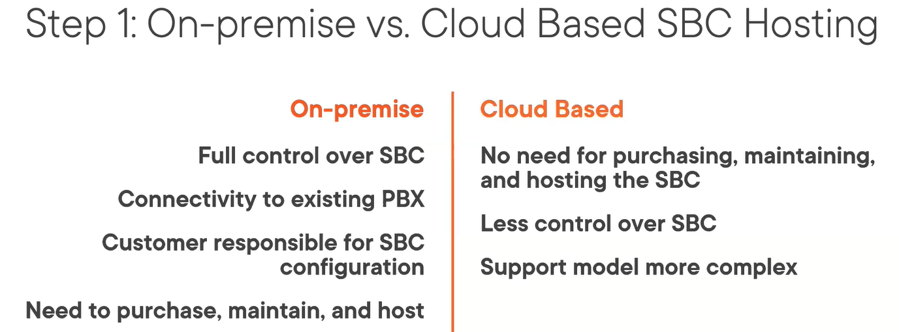
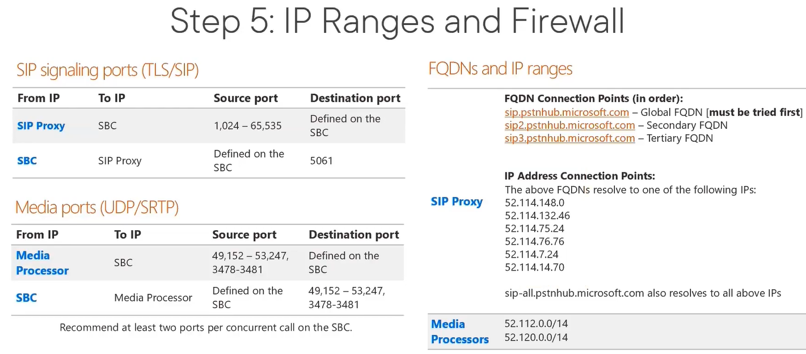
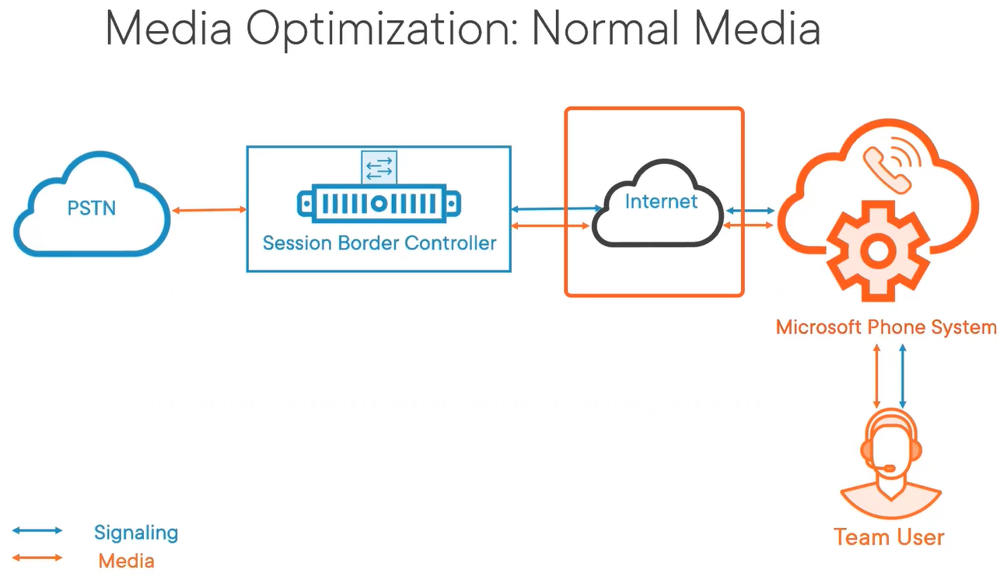
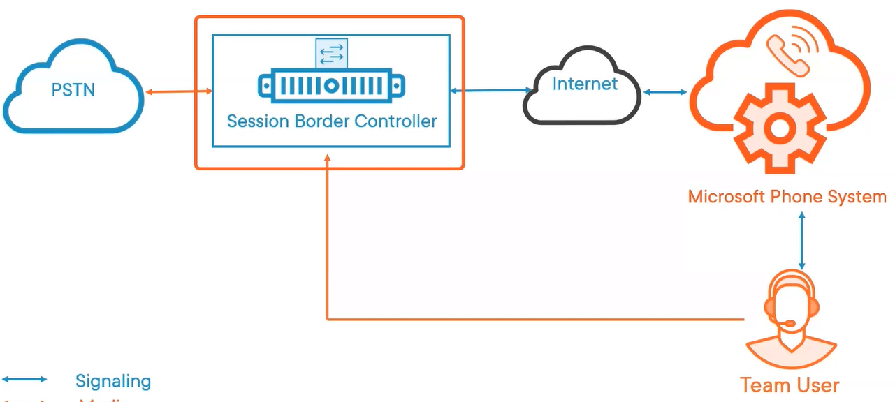

:::tip

Notes from March 2022

:::

### Plan and Design Direct Routing Call Flows {#adf2ac451c0144ecb53ae36feb8d85cb}

- Overview
	- Different certified SBCs for PSTN connectivity options
	- Licensing Required for Direct Routing
	- Steps required to deploy Direct Routing
	- Benefits of optimizing media flow
- **Microsoft Certified SBCs**
	- Can be deployed into a datacenter, onpremise
	- Some are always available on AWS or Azure
	- Examples
		- AudioCodes
		- Ribbon communications
		- Oracle
		- Cisco
		- Avaya
		- TE-SYSTEMS
- **Teams Environment**
	- Microsoft PhoneSystem is hosted in Cloud and is part of M365
	- SBC
	- Users are working in hybrid model
	- Service Providers connect those users to the PSTN world
- **Licensing Required for Direct Routing**
	- Microsoft 365 account
	- Microsoft Teams - Any BusinessLicense
	- Microsoft Phone System - Add-on License
	- E1/E5 with Phone System, E5 included, BusinessVoice included
- **Steps required to deploy Direct Routing**
	1. On-Premise or Cloud Basec SBC
	2. Endpoints Licensing
	3. SBC
	4. FQDNs and Certificates
		- FQDN for the SBC
		- The certificates installed on the SBC
	5. IP Ranges and Firewall
		- SBC needs to connect to Mirosoft
		- Ports needs to open for voice
	6. Voice Routing (Optional)
- On-premise vs. Cloud Based SHBC Hosting, SBC

	

	

- Connectivity
	- Allows Teams to Interconnect with other Voice Components
- Security
	- Acts as a Firewall for Session Initiation Protocol (SIP) Traffic
- Media Services
	- Transcodes and Supports Voice and Video Calls

		

		

		

- **Voice Routing**
	- Objects used to configure Voice Routing
		- Voice routing policy
		- PSTN Usage Records
		- Voice Route
		- Dial Plan
		- Gateway (Trunk)
	- After the SBC has a connection to M365 a voice route with regext pattern must be configured
		- A voice route is selected by priority
		- Voice routes are assigned to the PSTN Usage Record and not the users
		- PSTN Usage Record are members of a Voice Routing Policy
- **Optimize Media**
	- Media Bypass
		- Direct media through SBC
		- Teams user must have access to the Public IP of the SBC
	- Local Media Optimization
		- Advanced Media Optimization
		- Granular call flows
		- Local information service
		- Location based routing
	- Diagrams

		

		

### Implement SIP Trunking with Direct Routing {#0d4a4ddc22b94e5f9a872c4b0d79c8ce}

- Overview
	- Implement SIP Trunking with Direct Routing
	- Configuration Objects for Direct Routing
	- How to Configure and Connect a Session Border Controller
	- Test Direct Routing Connections
- Configuration Required for Direct Routing
	- Connect the SBC with Microsoft Phone System
	- Enable Users for Direct Routing
	- Call Routing
- Enable Users for Direct Routing
	- Teams license
	- M365 Phone System
	- Assign Phone Number
- Types of Phone Numbers
	- User Phone Number
		- For End Users DID
	- Service Numbers
		- Auto Attendants
		- Call queues
- Call Routing Objects
	- PSTN Usage Records
		- Defines the type of a call, specify type or class - internal, local call, long distance or international call
		- You cant deny international call
		- Based on number patterns
		- Assigned to Voice Routes

Plan and Configure Direct Routing

- Overview
	- Exend a Direct Routing Infrastructure
	- Location Based Routing
	- On-network conferencing
	- Gateway translation rules
	- Emergency calling policies for users by using a Teams emergency call routing policy
- Location Based Routing
	- Toll Fraud
		- Illegal to bypass the Public Switched Telephone Network
		- Telecom industry in loss
		- Organization doing Toll fraud penalized
	- Outbound PSTN Calls Requirements for User
		- Network Site Enabled for LBR
			- Calls Egress through the corresponding gateway
		- Network Site not Enabled for LBR
			- Calls Egress through a gateway not enabled for LBR
	- Receive or Trans Call
		- Answering endpoint located in the same site as call ingresses through LBR gateway
		- Transfer PSTN calls to endpoint at same site as user who attempts transfer
		- Transfer user to PSTN, call must be transferred through LBR gateway at same site as initial caller
	- Overview
		- Admin associates IP subnet and PSTN gateway to network site
		- Location determined by IP subet at the time of PSTN call
		- A user clients located at different sites - routing separately based on endpoint location
		- LBR needs to be applied to
			- Users
			- Network sites
			- PSTN gateways
	- Apply LBR at the User Location
		- Only applies to users set up for Direct Routing
		- Users must be enabled for Location-based Routing if they are under toll bypass restriction
		- User enabled for Location-Based Routing an an LBR site, must call through a LBR gateway connected to the site
		- Routing is based on the users client site can be

			categorized

			in the following way:

			- User located at same LBR site associated to PSTN gateway where their DID (Direct Inward Dialing) is assigned
			- User located at a different LBR site not associated to PSTN gateway where their DID (Direct Inward Dialing) is iassigned
			- User located at an internal site that's not enabled for LBR
			- User located at an unknown site
		- Apply LBR at the network site
			- Enable LBR at network sites to determine gateways to route LBR enabled users when roaming
			- If user enabled for LBR roams to LBR site, only LBR PSTN gateway enabled at that site can be used for outbound calls
			- If LBR user roams to non-LBR site, any non-LBR gateway can be used for outbound calls
		- Apply LBR at the PSTN Gateway
			- Gateways are associated to site to determine a user who is enabled for LBR can be located for PSTN calls
			- Gateways must be enabled for LBR to ensure that it´s under toll bypass restrictions and can´t be used by users who aren´t enabled for LBR
			- The same gateway may be assocaited to multiple sites and it can be configured to be enabled for LBR or not enabled for LBR, depending on the site
- On-network Conferencing
	- Prerequisites
		- Ensure all users for audio conferencing are using Teams for all meetings
		- Assign audio conferencing licenses to all users who will be using on-network conferencing
		- Set up the audio conferencing service
		- Set up your SBC for direct-routing
	- Enable Dial-In Calls Routing for Microsoft Audio Conferencing through Direct Routing
		- To route dial-in calls made by on-premises users to the audio conferencing service through direct routing, configure routing rules for SBCs and PBXs
		- Configure telephony equipment of sites to route calls to any service number of the conference bridge of the organization through a direct routing trunk
		- You can find the service numbers in Teams admin center under Meeting - Conferencing Bridges
- Gateway Translation Rules
	- Change the number, for outbound, and/or inbound calls, based on the number patterns
	- The policy applied at the SBC gateway level
	- Assign multiple translation rules to an SBC, applied in the order they appear when listed in PowerShell
	- Change the order of the rules in the policy
	- Number Translation Rules Policy
		- Can be used to translate the numbers of following calls
			- Inbound Calls
				- Calls from a PSTN endpoint to a Teams client
			- Outbound Calls
				- Calls from a Teams client to a PSTN endpoint
			- PowerShell
				- `New-CsTeamsTranslationRule`
				- `Set-CsTeamsTranslationRule`
				- `Get-CsTeamsTranslationRule`
				- Remove-CsTeamsTranslationRule
				- Set Translation rule to Gateway with either
					- `New-CSOnlinePSTNGateway`
					- `Set-CSOnlinePSTNGateway`
- Emergency Call Routing Policy
	- Enhanced emergency services enabled for users
	- Numbers used to call emergency services
	- How calls to emergency services are routed
	- Apply only to Direct Routing. Not to Calling Plans or Operator Connect.
	- Emergecy Calling Policy Assignment can be done to
		- Users
			- Automatically Global policy or assigned custom policies
		- Network Sites
			- Create and assign custom policies
			- Overrides the user policy
	- How to assign a custom emenergency call routing policy to
		- Users
			- Directly to user
			- Batch assignment - if supported by policy type
			- Group assignment - if supported by policy type
		- Network sites
			- `Set-CSTenantNetworkSite -Identity -EmergencyCallRoutingPolicy`

Deploy and Maintain a Survivable Branch Appliance

- Overview
	- SBA and its prerquisites
	- Maintenance and updates for SBA and SBC
	- Configure SBA policies to users
- Survivable Branch Appliance SBA for Direct Routing
	- WAN outage - no connection to Microsoft Phone System
	- SBC connected through Local Area Network
	- SBC connected to the PSTN for inbound/outbound calls
- Prerequisites for SBA
	- Supported SBA
	- Media bypass on SBC configured
	- TLS1.2 enabled on SBA
	- Ports 3443, 4444 and 8443 for Teams Client
	- Port 5061 for SBC
	- UDP Port 123 for NTP server
	- Port 443 for Microsoft 365
	- Supported Teams Clients
		- Teams for Windows Desktop
		- Teams for macOS desktop
		- Teams for mobile
		- Teams phones
- SBA Functionality
	- During internet outage, Teams client switches to SBA automatically, ongoing calls continues, with no interruptions
	- No action required from users
	- Client falls back to normal operation mode and connect to other Teams services
	- SBA uploads collected Call Data Records to cloud and call history will be updated
- Calling related functionality in Offline Mode
	- Making PSTN calls via local SBA/SBC with media flowing through the SBC
	- Receiving PSTN calls via local SBA/SBC with media flowing through the SBC
	- Hold and resume of PSTN calls
- Configuration steps to assign Users/Sites a SBA
	- **Only possible with PowerShell**
	- Create the SBAs
	- Create the Teams branch survivability policy
	- Assign the policy to the users
	- Register an application for the SBA with AAD
		- Read required data from M365
		- Only one AAD application needed for all SBAs
	- Steps to register
		- Reigster the application
		- Set the implicit grant token
		- Set the API permissions
		- Create the client secret
	- PowerShell
		- `New-CSTeamsSurvivableBranchAppliance`
		- `New-CsTeamsSurvivableBranchAppliancePolicy`
			- Creates a policy for an appliance
		- `Set-CsTeamsSurvivableBranchAppliancePolicy`
		- `Grant-CsTeamsSurvivableBranchAppliancePolicy`
			- Assigns user to Policy
- Session Border Controller configuration and support for SBA
	- Each Vendors documentation is important
	- Deployment Options
		- Hardware or software based SBA
		- Can be installed on a virtual machine
		- Can be enabled on same SBC or as a separate device
	- SBA Calling Features
		- Teams to Teams and PSTN Calls
		- Teams to PSTN calls only (Some devices)
	- SBA Advance Calling Features not supported
		- Call forwarding delegation
		- Call queues
		- Call group
		- Music on hold
	- Known Issues with SBA
		- New SBA may take some time before used by SBA policies
		- After SBA policy assigned, may take some time before SBA is shown in Get-CsOnlineUser
		- Reverse number lookup against Azure AD Contacts is not done
		- Call forwarding settings does not work

