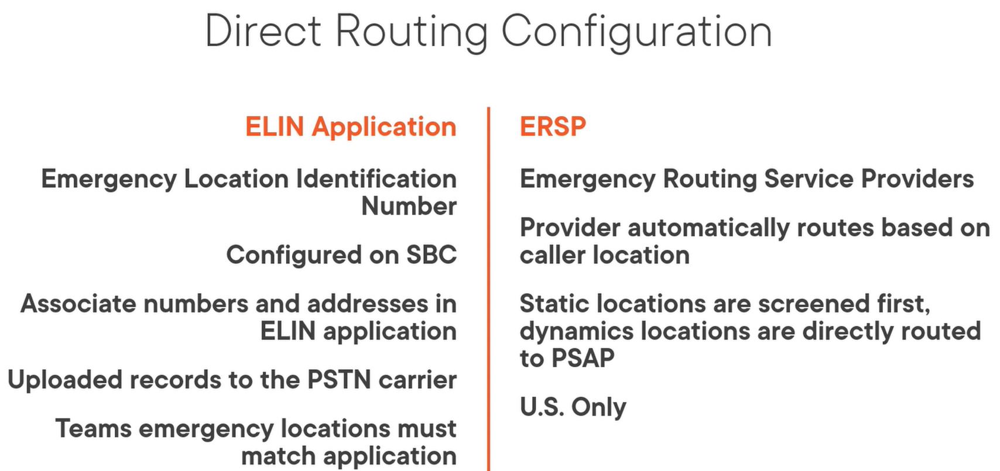
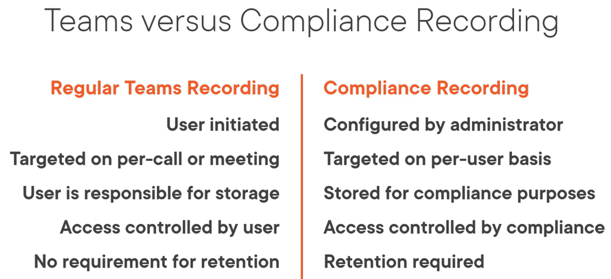
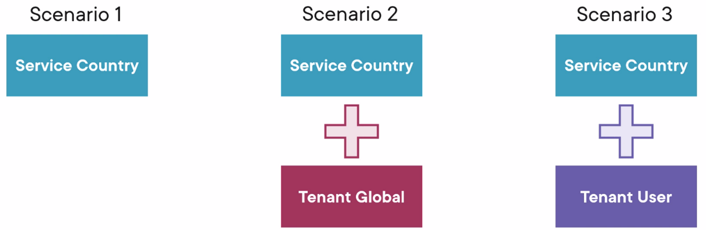
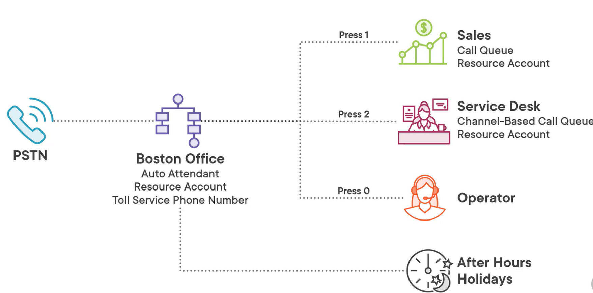

:::tip

Notes from March 2022

:::


## Planning and Designing a PSTN Solution {#0da211ab5eaf4ef19ca4bfe10645c9db}


- Teams Phone System
	- Enables PBX funcionality in the cloud (Private Branch Exchange)
	- Enables features like
		- Call transfer
		- Call forwarding and simultaneous ringing
		- Call park and retrieve
		- CallerID
		- Cloud voicemail
		- Any manym ore
	- Requirement for any Teams PSTN solution (Public Switch Telephone
	Network)
- PSTN Connectivity Solutions
	- Calling Plans
		- Use Microsoft cloud infrastructure for PSTN connectivity
	- Direct Routing
		- Bring your own carrer using Session Border (SBC)
		- If you want to use your current provider
	- Operator Connect
		- Third party solution that brings PSTN connectivity to Teams
		- SBC is managed by a third party and they take care for it for
		you
- **Calling Plans**
	- All-in-the-cloud solution where Microsoft is your PSTN carrier
	- Available in two plans:
		- Domestic Calling Plan
		- Domestic and International Calling Plan
	- Available in multiple countries
		- Availability depends on user location, not tenant location
	- Calling Plan Minutes Example
		- US Domestic - 3000 minutes
		- US Domestic and International - 3000 domestic, 600
		international
		- Minutes are pooled by the tenant level
		- Users share minutes based on location and Calling Plan Type
		- Minutes are for outbound calls
			- Inbound is for “free”
	- List from MS available to see for which countries calling plans are
	available
		- [Country/region
		availability - Audio Conferencing, Calling Plans - Microsoft Teams |
		Microsoft Docs](https://docs.microsoft.com/en-us/microsoftteams/country-and-region-availability-for-audio-conferencing-and-calling-plans/country-and-region-availability-for-audio-conferencing-and-calling-plans)
		- Also includes information what is included in the national calling
		plans
- **Direct Routing**
	- Bring-Your-Own-Carrier
	- Use certified Session Border Controller
		- Vendors provide information how to setup SBC with Teams
	- Keep phone numbers with current carrier
		- Makes the migration to Teams easier
		- Helps if the contract is still running for a while
	- Integration with existing infrastructure
		- Analog devices
		- Call centers
	- Scenarios
		- Calling Plans not available in country
		- Backup or supplement to Calling Plans
	- Diagram:

		


		Untitled

	- Operator Connect
		- Telephone carrier manages SBCs and PSTN connectivity
			- Direct Routing as a Service
		- Microsoft Operator Connect program
		- Usefil if:
			- Calling Plans not available in region
			- Preferred carrier participates in program
			- Find a new carrier integrated with Teams
- **Licensing Requirements**
	- Phone System
		- Enables PBX capabilities in Teams
		- Requires user to have a base Team license
			- Included in SKUs like M365 Business, E1, E3, and E5
		- Add-on for most scenarios
			- E5 includes Phone System
		- Required for both Calling Plans and Direct Routing
	- Direct Routing requires a Teams license and a Phone System addon
	license
		- Calling Plan not needed
	- Microsoft 365 Business Voice
		- Small business (under 300 users)
		- Voice license bundle
			- Phone System
			- Audio Conferencing
			- With or without Calling Plan
		- Can be combined with
			- M365 Business
			- M365 Enterprise E1, E3, E5
		- **Will be replaced by Teams Phone with Calling
		plan**
	- Teams Phone with Calling Plan
		- New SKU
			- Replaces M365 BusinessVoice for SMBs
		- Single Package
			- Includes Phone System and Domestic Calling Plan
			- Missing the conference licensing from Business Voice
	- Communication Credits
		- Pay or additional calling minutes
		- Minute pool depletion
		- Domestic users make international calls
			- If a user has domestic plan they can be give communication credits
			for internationalcalls
		- Consumption billing
		- Unlimited licenses
		- Toll-free calling
	- Audio Conferencing
		- Enables dial-in number on Teams meetings
			- Adds a phone number and a conference ID
		- Scenarios:
			- Teams app is not available
			- Meeting is audio only
			- Internet connectivity is limited
			- Dial-out to add users (call-me-at)
		- Add-on license assigned to individual users
			- Included in E5
		- Starting March 1, 2022:
			- **Unlimited dial-in capabilities added to M365 and O365
			licenses**
	- Speciality Licenses
		- Microsoft Teams Rooms
			- Designed for meeting room devices
			- Standard and Premium
			- Premium includes a service where MS manages the Device (Patch, Issue
			troubleshooting)
		- Commen AreaPhone
			- Includes Team and Phone System lienses
		- Phone System Virtual User
			- Call Queues and Auto Attendants

			


			Untitled

- **Certified Contact Centers**
	- Auto Attendants and Call Queues meet most organization’s needs
	- Some organizations need advanced capabilities
		- Integration with business tools and workflows
	- Contact Center as a Service (CCaaS)
	- Certified Contact Center solution providersthat integrate with
	Teams
	- Integration Models
		- Connet Model
			- Uses SBCs and Direct Routing to connect to provider solution
		- Extend Model
			- Uses Azure Bots and Graph API to create Teams app
		- Power Model
			- Uses SDK to provide Teams experience inside of customer app
	- Network Topology
		- Network topology includes details about enterprise network
		- Network topology is required for:
			- Location-based routing in Direct Routing
			- Dynamic emergency calling
		- Policy assignments at a network level
		- Network Topology Components
			- Network Subnet
				- Network CIDR ranges where clients are found 192.168.10.0/24
			- Network Site
				- Collection of Network Subnets representing a physical location
			- Network Region
				- Collection of Network Sites over a geographic region
		- Trusted IP Address
			- External IP address of enterprise network
			- Determines if user is inside the corporate network
				- If external IP address is in trusted list, verifies internal
				subet
				- If no match, then user’s location is classified as unknown
			- Helps determine available voice features


### Designing and Configuring Emergency Calling {#50626065391d458d977e4b66d06f532e}


- Overview class
	- Understanding emergencylocations
	- Compare emergencyc alling
		- Static and dynamic
	- Define Location Information Service database
	- Create emergency calling policies
	- Test emergencyc calling
- **Emergency Addresses**
	- Teams Client address can be seen in Settings -> Calls ->
	Emergency location at the bottom

		


		Untitled

- Terminology
	- Emergency Address: physical address (60 State St, Boston, MA
	02109)
	- Place: Floor, building, wing, office number (Suite 800)
	- Emergency Location: Emergency Address and optional Place
	- Registered Address: Emergency Address asssigned to a user
		- Their address of record for their location
		- Only applies to Calling Plans
- Managing Emergency Addresses
	- Validation ensures address is legitimate
	- Geo codes
		- Used in some countries to help route emergency calls
	- Registered emergency address required for phone number
	management
- Static Emergency Calling
	- Applies to Calling Plans and Operator Connect
	- Automatically enabled
	- Required for asssigning or procuring phone numbers
	- Emergency address included in emergencycalls
	- If call is made then it is routed to a Public Safety Answering Point
	(PSAP)
	- Emergency calling routign depends on country calling network
		- Calls can be screened to determine user location
- Dynamic Emergency Calling
	- Appliest o Calling Plans, Operator Connect, and Direct
	Routing
	- Dynamically determining location based on Teams client
	- Overrides any static, registered address
	- Used to determine appropriate PSAP
	- Requires Location Information Service (LIS) database
		- Seperate from Network topology
	- Add trusted IP addresses for corporate network
		- To determine if user is in the office or at home
	- LIS Components
		- Subnet
		- Wireless Access Point
			- Upload of basic identifiers /BSID possible
			- Each Access Point has ist own BSID
		- Switches
			- Uses chassy ID
		- Ports
			- Chassy ID is needed and Ports
		- Direct Routing Configuration

			


			Untitled

		- **Emergenc Policies**
			- Available under Voice - Emergency Policies
			- Emergency Calling Policy
				- What happens when a Teams user makes an emergency call
				- Applies to Calling Plans and Direct Routing
				- Notification can be sent to user, group or include another phone
				number into the call
			- Emergency Call Routing for Direct Routing
				- Control how emergency calls are routed
				- To which SBC should the call be routed


### Phone Numbers {#ac41fa0e8e2c438288ec3ef929791689}


- Overview
	- Understand different phone number types
	- How to aquire phone numbers
		- Provision from portal
		- Port orders
	- Demos
		- Aquiring phone numbers
		- Managing user phone numbers
		- Submitting requests to the Phone Number Service Center
- Phone Number Types
	- User or Subscripter numbers
	- Assign to users in the organization
	- Designed for low call volume
		- Higher call volumes are meant to queues
	- Two types
		- Geographic: related to specific area - most common number
		- Non-geophraphic: no relationship to an area - for example in Denmark
		common
	- Service Phone numbers
		- Used for audio conferencing, auto attendants and call queues
		- Designed for higher call volumes
		- Two types:
			- Toll
			- Toll-free: no cost to caller
		- Can convert between user and service phone numbers
- Acquiring phone numbers
	- Port Orders
		- Trans phone number to Microsoft Teams
		- Microsoft becomes service provider
		- Port process differes based on country
			- Letter of Authorization (LOA)
		- Full and partial ports
		- Port timing depends on losing carrier
		- Convert user to service after port completion
	- Getting Phone Numbers
		- Calling Plans
			- Teams admin center, Port order, manual request
			- Manual request if its large number of numbers or if you want a
			certain block
		- Operator Connect
			- Operators website, Port to order, added to tenant
		- Direct Routing
			- Managed by carrier, Assigned using PowerShell


### Configuring Phone Policies {#eb50ce9ae0cb44a38343bcad19f6e48a}


- Overview
	- Explore Phone System policies
		- Calling policy
		- Caller ID policy
		- Call park policy
	- Configure inbound and outbound call restrictions
	- Create compliance recording policy
	- Managing dialing with dial plans
- Calling Policy
	- Controls calling features for users
		- Private calling
		- Call forwarding
		- Voice mail
		- Call groups
	- All policies have a Global policy, or custom policy
	- Caller ID Policy
		- Indound
			- Display incoming external phone number
			- Looks for matches in Azure or personal contact
		- Outbound
			- User’s telephone number (default)
			- Anonymous, substitute with service number, CNAM
		- Options
			- Block incoming caller ID
			- Override the caller ID policy
			- Replace the caller ID with - Users number, Service number or
			Anonymous
			- Replace the caller ID with this service number
	- Call Park Policy
		- Enabled by default
		- User places call on hold
		- Unique code is generatedf or retrieval
		- For example in a department store setting
		- Policy manages code range and timeout values
		- Options
			- Call park - Off / On
			- Call pickup start of range
			- Call pickup end of range
			- Park timeout (seconds)
- Inbound Call Blocking
	- Block inboundcalls from PSTN at the tenant global level
	- Create number patterns using regex to match incoming calls
		- Match found, call is rejected
	- PowerShell configuration only
		- New-**CsInboundBlockedNumberPattern**
		- Test-CsInboundBlockedNumberPattern -PhoneNumber 13125551234
			- IsNumberBlocked (True or False)
	- Individual users cannot manage this global list
		- Users can configure personal block list in Teams client
		- Done from Calls - Contacts - Block contact
- Outbound Call Restrictions
	- Control users from making outbound PSTN calls
	- Control options
		- Internal and Demostic (default)
		- Domestic
		- None
			- Like for conferencing systems
- Compliance Recoding
	- Allows to record calls and online meetings automatically for
	retention
	- Capture audio, video, screen share, chat
	- Provided through third-party through Compliance Recording
	Certification Program
		- Communications Platform APIs
	- Made possible through Recorder (Azure bot)
		- Has a direct connection and is added to the conversation
	- Policy managed through PowerShell
	- Teams versus Compliance Recording:

		


		Untitled

	- PowerShell commands to configure
		- `New-CsOnlineApplicationInstance`
			- To create the RecordingBot
			- ApplicationID must be an existing Azure Bot Recording
			Application
			- Create a resource account (under Voice -> Resource accaunts)
			- User account is blocked
		- `Sync-CsOnlineApplicationInstance`
			- To sync to Azure AD
		- `New-CsTeamsComplianceRecordingPolicy`
			- Create a policy
			- A Recording Application needs to be assigned
		- `Set-CsTeamsComplianceRecordingPolicy -ComplianceRecordingApplication @(New-CsTeamsComplianceRecordingApplication)`
		- `Grant-CsTeamsComplianceRecordingPolicy`
			- To assign user to Policy
			- Identity can be SIP
- Dial Plans
	- Translating dialed phone numbers
	- Set of normalization rules defined using regex
		- Examples [Phone
		Number Normalization Rule Regular Expressions (microsoft.com)](https://support.microsoft.com/en-gb/topic/6ea76427-0892-4237-b024-10b418dcb05e)
	- Used for call authorization andvoice routing
		- Modify extensions into full E.164 numbers
		- Add digits for locald ialing
	- Administration through Teams admin center and PowerShell
	- **Dial plan types**
		- Service Scoped - Mandatory
			- Country or region-based
			- Automatically always assigned
			- Rules cannot be modified
			- Can be combined with Tenant dial plan
		- Tenant scoped - Optional
			- Customized dial plans
			- Combined with Service plan
			- Global or user applicable
	- **Dial Plan Scenarios**

		


		Untitled

	- **PowerShell**
		- `Get-CsDialPlan -Identity US |Select-Object -ExpandProperty NormalizationRules`
		- `Get-CsTenantDialPlan -Identity Global`
		- `New-CSTenantDialPlan`
		- `New-CsVoiceNormalizationRule`
		- `Set-CsTenantDIalPlan`
		- `Test-CsEffectiveTenantDialPlan -Identity UPN -DialedNumber`
			- Shows the matching rulef or the number
	- **Dial Plan Creation**
		- External dialing prefix can be attached
		- Normalization can be appliedin GUI in plan
		- Rules can be ranked. After on matches no further processing of the
		rules


### Configuring Auto Attendants and Call Queues {#c3becbdc9cd840ac974c91963b2c46a6}


- Overview
	- Teams Voice applications
		- Call Queues
		- Auto Attendants
	- Managing resourcre accounts
	- Designing voice applications
	- Hybrid Deployment overview
- Call Queues
	- Holding area for callers
	- Connects a caller to a group of agents
		- Agents are enterprise voice-enabled (min Phone System)
	- Multiple optionsf or call distribution
	- Agent opt-in or opt-out capability
	- Custom hold music
	- Handle queue overflow or timeouts
	- Routing Methods
		- Attendant Routing: ring all agents at the same time
		- Serial Routing: rings agents one at a time in specific order
		- Round Robin: balances so each agent gets the same number of
		calls
		- Longest Idle. Routes to longest available agent based on status
	- Additional Configuration
		- Conference mode (new feature)
			- Reduces time for caller/agent connection
			- Not supported when routed from a Direct Routing gateway enabled for
			Location Based Routing
		- Channel-Based
			- Can take up to 24hours to be available
			- [Create
			a call queue in Microsoft Teams - Microsoft Teams | Microsoft
			Docs](https://docs.microsoft.com/en-us/microsoftteams/create-a-phone-system-call-queue)
			- Support up to 200 agents via a Teams channel
			- Shared call history and voice mail
				- Can view shared call history and voicemail
				- Needs a resource account
		- Custm Music on Hold
			- Teams provides default music
			- Upload MP3, WAV, or WMA file
- Auto Attendants
	- Menu system for routing incoming calls
	- Direct to people, call queues, voice mail or another auto
	attendant
	- Use service phone numbers for external access
	- Features
		- Text-to-speech or recorded audio
		- Keypad or voice recognition
		- Operator: Can be an external phone number or a call queue
		- Business hours and holidays
		- Set timezone
		- Multiple languages supported
		- Directory search (name or extension)
			- Scope can be set (Include group, exclude group)
	- Menu actions
		- Redirect to operator or person in organization
		- Redirect to Voice app (another auto attendant, call queue)
		- Redirect to Voice mail
		- External phone number
		- Announcement (announcing that office is closed or the way to the
		office)
	- M365 Group Shared Voice Mail
		- Enabled for voice mail by default
		- Users access shared mailbox to manage messages
		- Define group as voice mail action target
		- Channel-based call queue, use them
			- Team is backed by an M365 group
- Resource Accounts
	- Disabled user object in Azure AD
		- Sign-in is blocked
		- Dedicated account for each call queue and auto attendant
		- Uses Phone System - Virtual User license
			- Free licenses available
			- When out, then assign regulary Phone System license
		- Can assign service phone numbers to resource account
			- Toll or toll-free
				- Toll-free need communication credits
	- **Licensing Resource Accounts**
		- Phone System -Virtual User license
			- Free license
			- Enabled Teams Phone System functionality
		- Outbound calling
			- Calling Plan
			- Operator Connect
			- Direct Routing (voice routing policy)
	- **Voice Application Design Example**

		


		Untitled

- **Hybrid Deployments**
	- Integrate with Skype for Business Server
		- Skype for BusinessServer 2019 or newer supports Cloud Voice features
			- Auto Attendant, Call Queue, Voice Mail
		- Incoming calls from Microsoft PSTN, Skype for Business Server, or
		SBC
		- Resource accounts can be homed online or on-remises
		- Requires hybrid configuration with Teams and Skype for Business
		Server
	- Hybrid Resource Account PowerShell

	```powershell
	# Create on-premises resource account for auto attendant or call queue          
	New-CsHybridApplicationEndpoint `
	          -ApplicationID <GUID> `
	          -DisplayName “Boston Office Auto Attendant” `
	          -SipAddress aa-boston-office@globointl.xyz `
	          -OU "ou=Boston,dc=globointl,dc=xyz“          
	# Assign an online service number to resource account          
	Set-CsHybridApplicationEndpoint `          
		-Identity aa-boston-office@globointl.xyz `          -LineURI tel:+14255550100          
	# Assign a Direct Routing or hybrid number to resource account          
	Set-CsOnlineApplicationInstance `          
		-Identity aa-boston-office@globointl.xyz `-OnpremPhoneNumber tel:+14255550100
	```


### Configure Audio Conferencing {#4ca85b5a95eb481db54518f01178512d}


- Overview
	- Audio Conferencing basics
	- Conference bridge settings
	- Number types
	- Licensing
	- Managing user settings
- Audio Conferencing Basics
	- Enables users to call into meetings
		- Up to 1000 dial-in attendees
	- Adds dial-in number and conference ID to Teams meetings
	- Scenarios
		- Poor internet connectivity
		- Audio-only meeting
		- Ease of use and convenience
	- Service phone numbers
		- Toll and toll-free
	- Multiple language support
	- Conferencing Bridge
		- Contains list of available dial-in phone numbers
		- Responsible for:
			- Answering incoming calls
			- Prompting for meetings Ids
			- Recording participant names
			- Authenticating using PINs
		- Each conference bridge has a default language
		- Number Types
			- Shared
				- Shared with other Team tenants
				- Cannot change default language
			- Dedicated
				- Dedicated to your tenant
				- Customizable language options
			- Toll-Free
				- Dial in free of charge
				- Uses Communications Credits
	- Operator Connect Conferencing
		- Use phone numbers from third-party providers
			- Must be member of Operator Connect program
		- Scenarios
			- More flexible allocation of numbers
			- Existing contract with carrier
			- Expanded global coverage
	- Outbound Dialing from Meetings
		- Dial-Out / Call-Me-At
		- Conferencing bridge creates an outbound call
		- Scenarios
			- Dial cell phone jor joining meeting audio
			- Add another person to meeting
		- Licensing and minute restrictions considerations
		- Can restrict dial-out using policies
- Licensing
	- Subscription Licensing
		- Audio Conferencing add-on license
			- Already included in E5 SKU
		- Only required for people scheduling or organizing dial-in
		meetings
			- Participants can dial-in without license
		- New for 2022
			- Microsoft adds unlimited dial-in for Teams meetings
		- Use Communication Credits for toll-free numbers
	- Pay-Per-Minute Licensing
		- Pay per-minute usage instead of monthlylicense
		- Available onlyt o volume licensing customers
		- More flexibility in pricing versus monthly subscription
		- Inbound calls to toll and toll-free Audio Conferencing numbers
		- Outbound calls placed to external phones from within meeting
	- Outbound Dialing Benefit
		- Each Audio Conferencing license provides 60 minutes of outbound
		calling per month
			- Pooled at tenant level
			- Based on purchase licenses
			- Only applies to subscription model
			- Applies to Zone A countries
		- Dialing out to non-Zone A countries required Communication
		Credits
			- Charged perminute of usage
		- Use policies to restrict outbound calling
		- **Outbound Dialing Scenarios**

			


			Untitled

- PowerShell
	- `Get-CsOnlineDialInConferencingBridge | Select-Object -ExpandProperty ServiceNumbers`
	- `Get-CsOnlineDialInConferencingSettings`
		- Has additional settings than in in the GUI like
		MaskPstnNumbersType: MaskedForExternalUsers
		- `Get-CsOnlineDialOutPolicy`
		- `Get-CsOnlineDialInConferencingUser`
			- Shows information like ServiceNUmber, TollFreeServiceNumber


