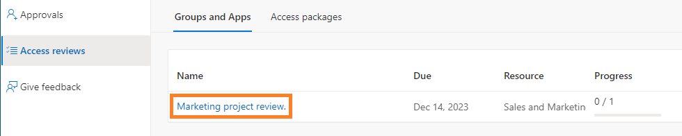

Testkopie von ourcloudnetwork.com


Zugriffsüberprüfungen in Microsoft Entra bieten eine Möglichkeit, den Zugriff auf Ressourcen in Ihrem Mandanten kontinuierlich zu überprüfen. Noch wichtiger ist, dass Sie als Eigentümer Ihres Mandanten den Ressourceneigentümern (von Gruppen oder Teams) ermöglichen können, den Zugriff externer Benutzer auf diese Ressourcen selbst zu verwalten, wodurch Ihre Arbeitslast reduziert und die Verantwortung verlagert wird.


Viele Organisationen verlassen sich auf die Kollaborationsfunktionen, die in Microsoft 365 verfügbar sind, wie Microsoft Teams, um mit externen Organisationen an Projekten zu arbeiten. Eine praktische Möglichkeit, dies zu tun, besteht darin, diese externen Benutzer als Gäste zu Ihrer Organisation einzuladen. Dies bringt jedoch seine Governance-Herausforderungen mit sich, die durch Zugriffsüberprüfungen gelöst werden.


## **Gruppenbesitzern ermöglichen, Zugriffsüberprüfungen zu verwalten** {#c1ffd71921ef45a9bf4464c96a1dda8f}


Zugriffsüberprüfungen für Gruppenbesitzer sind standardmäßig deaktiviert. Um diese Funktion zu aktivieren, melden Sie sich als Globaler Administrator bei Ihrem Microsoft Entra Mandanten an und folgen Sie den unten aufgeführten Schritten:

1. Erweitern Sie **Identity Governance** und wählen Sie **Zugriffsüberprüfungen**.
2. Wählen Sie **Einstellungen**, dann aktivieren Sie **Gruppenbesitzer können Zugriffsüberprüfungen für Gruppen, die sie besitzen, erstellen und verwalten**.

	


## **Gruppenbesitzer-Zugriffsüberprüfungen mit Microsoft Graph PowerShell aktivieren** {#46f9fb90af52450191c5d00fb097fb63}


Sie können diese Funktion auch mit Microsoft Graph PowerShell aktivieren.


_(Für Schritte zur Installation des Microsoft Graph PowerShell SDK, schauen Sie sich meinen Beitrag_ [_hier_](https://ourcloudnetwork.com/how-to-install-the-microsoft-graph-powershell-sdk/)_.)_


```powershell
Connect-MgGraph -scopes Policy.ReadWrite.AccessReview

$params = @{
	isGroupOwnerManagementEnabled = $true
}

Update-MgBetaPolicyAccessReviewPolicy -BodyParameter $params
```


## **Erstellen einer neuen Zugriffsüberprüfung als Gruppenbesitzer** {#f461ccd402454a1eb99f40dfdbc6d0d3}


Jeder Benutzer, der Eigentümer einer Gruppe ist, kann nun über das Microsoft Entra Admin Center Zugriffsüberprüfungen für Gruppen, die er besitzt, erstellen. Befolgen Sie die unten aufgeführten Schritte, um eine neue Zugriffsüberprüfung zu erstellen.


1. Melden Sie sich bei Ihrem Standardbenutzerkonto an (ohne Rollen) und öffnen Sie den [Identity Governance Access Reviews blade](https://entra.microsoft.com/#view/Microsoft_AAD_ERM/DashboardBlade/~/Controls).
2. Klicken Sie auf **Neue Zugriffsüberprüfung**.

	

3. Auf der Seite **Überprüfungstyp** haben Sie nur die Möglichkeit, den **Überprüfungsbereich** auf **Teams + Gruppen auswählen** einzustellen. Klicken Sie auf **Gruppen auswählen** und Sie sehen nur die Gruppen, die Sie besitzen, wählen Sie Ihre Zielgruppe aus und klicken Sie auf **Auswählen**.

	

4. In unserem Szenario werde ich eine einstufige Überprüfung für die Gruppenbesitzer durchführen. Auf der Überprüfungsseite haben Sie die Möglichkeit, spezifische Prüfer auszuwählen.

	Ich schlage vor, dass Sie **Gruppenbesitzer als Prüfer** auswählen. Dann erstellen Sie eine **Fallback-Prüfergruppe mit ernannten Benutzern**. Wenn eine Gruppenbesitzer nicht mehr existiert (sie verlassen zum Beispiel die Organisation), werden die Fallback-Prüfer von der Überprüfung informiert und können die Governance über die Gruppe weiterhin aufrechterhalten.


	Sie sollten auch die Dauer, die Wiederholung und das Enddatum der Überprüfung auswählen, hier sind meine Empfehlungen:

	- **Dauer:** 2 Tage
	- **Überprüfungswiederholung:** Monatlich
	- **Enddatum:** Nie

	_**Bei der Verwaltung von Gastbenutzern sollte es nie einen Zeitpunkt geben, zu dem ihr Zugriff auf Ihre Daten nicht überwacht oder überprüft wird. Natürlich können Sie diese Einstellungen nach Belieben ändern, aber stellen Sie sicher, dass das Enddatum auf nie gesetzt ist, wenn Sie Gastbenutzer überprüfen.**_


	

5. Die **Einstellungen nach Abschluss** erlauben es Ihnen, wichtige Einstellungen rund um die automatische Behebung zu definieren.
	- **Ergebnisse automatisch auf Ressource anwenden:** Wenn der Zugriff des Benutzers verweigert wird, wird sein Zugriff auf die Ressource automatisch entfernt, nachdem die Überprüfung abgeschlossen ist, ansonsten ist eine manuelle Behebung erforderlich.
	- **Wenn Prüfer nicht antworten:** Ich habe **Keine Änderung** gewählt, jedoch empfehle ich für die meiste Governance, **Zugriff entfernen** auszuwählen. Alle Optionen beinhalten:
		- Keine Änderung
		- Zugriff entfernen
		- Zugriff genehmigen
		- Empfehlung annehmen
	- **Aktion auf abgelehnte Gastbenutzer anwenden:**
		- Entfernen der Mitgliedschaft des Benutzers aus der Ressource
		- Blockieren des Benutzers für 30 Tage vom Anmelden, dann Entfernen des Benutzers aus dem Mandanten.
	- **Am Ende der Überprüfung Benachrichtigung senden an:** Sendet eine Benachrichtigung an spezifische Benutzer.

		

6. Für die restlichen Optionen auf der Einstellungsseite, obwohl sie das Ergebnis nicht beeinflussen, ermöglichen sie Ihnen, Benachrichtigungen und Erinnerungen für die Überprüfung zu überprüfen und liefern auch hilfreiche Informationen wie das letzte Anmeldedatum des Gastbenutzers. Dies wird Ihnen helfen zu entscheiden, ob Sie den Zugriff entfernen oder nicht.

	

7. Klicken Sie auf **Überprüfen + erstellen**, dann definieren Sie einen Überprüfungsnamen und klicken Sie auf **Erstellen**.


## **Abschluss der Zugriffsüberprüfung** {#906dce5363d44650b5e1c05387a384df}


Wenn die Zugriffsüberprüfung beginnt (wie durch das Startdatum innerhalb der Überprüfungseinstellungen definiert), erhält der Prüfer der Gruppe eine Benachrichtigungs-E-Mail mit einem Link zur Durchführung der Überprüfung.


Der Link führt sie zur Zugriffsüberprüfungsseite innerhalb von [https://myaccess.microsoft.com/.](https://myaccess.microsoft.com/) Sie können auch direkt zu diesem Link navigieren und dann den Namen der Zugriffsüberprüfung auswählen, die Sie beginnen möchten.





Wie Sie sehen können, empfiehlt Entra, dass der Benutzer, da er in den letzten 30 Tagen inaktiv im Mandanten war, den Zugriff auf die Ressource verweigert bekommen sollte.


Sobald der Zugriff verweigert wird, wird er in der Liste als verweigert angezeigt. Diese Aktion kann rückgängig gemacht werden, wenn eine falsche Entscheidung getroffen wurde.


## **Auswirkungen der Zugriffsverweigerung in einer Zugriffsüberprüfung** {#ec9dc88ec5a94ab2ad359f5b871071fd}


Sobald der Prüfer die Überprüfung durchgeführt und dem Gast den Zugriff auf die Ressource verweigert hat, wird der Gastzugriff auf die Ressource entfernt, sobald die Überprüfung abgeschlossen ist.


Dies geschieht erst, wenn der Dauerzeitraum abgelaufen ist und nicht sofort. Wenn zum Beispiel die Überprüfungsdauer 2 Tage beträgt und Sie den Zugriff am ersten Tag verweigern, hat der Gast noch einen weiteren Tag Zugriff, bevor sein Zugriff entfernt wird.


## **Abschluss** {#5f3024b894ef406ab7f224f1b8026cba}


Zugriffsüberprüfungen sind ein mächtiges Werkzeug, um sicherzustellen, dass Gastbenutzer in Ihrem Mandanten nicht länger Zugriff auf Ressourcen haben, als sie benötigen. In diesem Beitrag habe ich gezeigt, wie Sie die Berechtigung zum Erstellen von Zugriffsüberprüfungen an den Eigentümer von Gruppen und damit an kollaborative Ressourcen in Ihrem Mandanten delegieren können.


Dies stellt sicher, dass Gastbenutzer in größeren Organisationen geregelt werden, wo es nicht machbar wäre, dass ein einzelnes Team sie verwaltet und die Verantwortung für sie übernimmt.