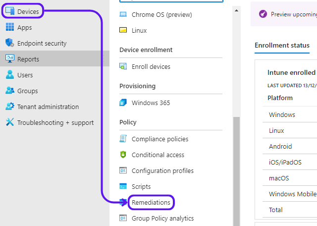
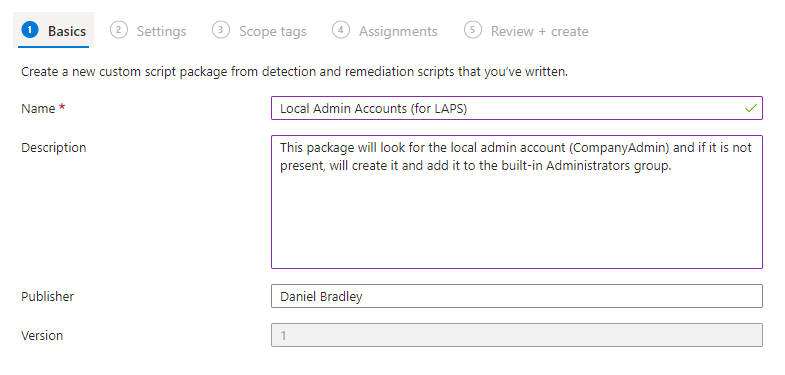
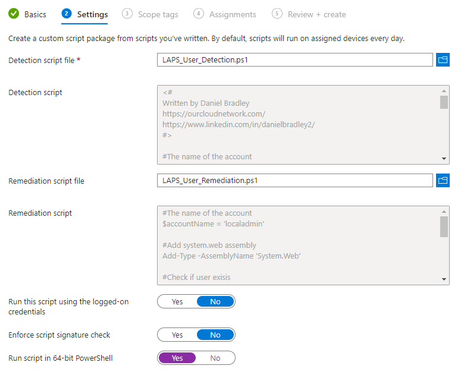
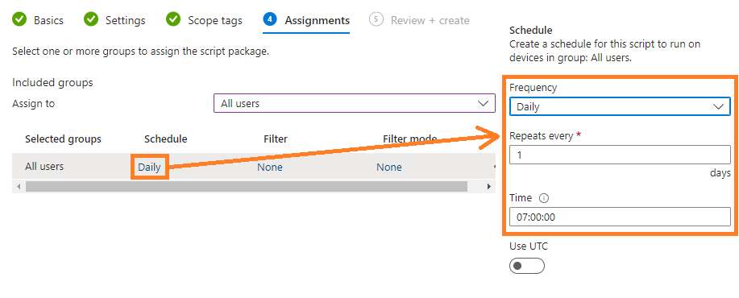
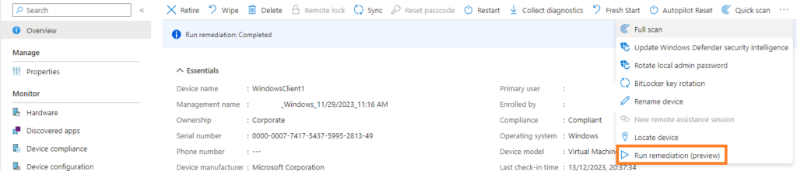

Testkopie von ourcloudnetwork.com


In diesem Tutorial zeige ich Ihnen, wie Sie ein neues lokales Administratorkonto auf Ihren Windows-Geräten mit Microsoft Intune erstellen. Obwohl es unter Fachleuten und MVPs einige bevorzugte Methoden zur Erstellung lokaler Admin-Konten gibt, verwenden wir hier ein einfaches PowerShell-Skript zur Erkennung und Erstellung des Kontos.


## **Sollten Sie das eingebaute lokale Admin-Konto verwenden?** {#221a56e76ac541199e4e7e9036acbd00}


Es wird oft gefragt, warum Sie die zusätzliche Komplexität der Erstellung eines neuen lokalen Admin-Kontos benötigen und warum Sie nicht einfach das eingebaute Windows-Konto verwenden können. Nun, die Begründung dafür lässt sich recht einfach in die folgenden Punkte zerlegen:


- **Das eingebaute Administratorkonto hat eine bekannte SID.** Selbst wenn das Konto umbenannt wird, kann es von einem Angreifer leicht aufgelistet werden.
- **Das Konto kann standardmäßig nicht gesperrt werden.** Dies macht es anfällig für Brute-Force-Angriffe. _(Seit dem 11. Oktober 2022 kann eine Kontosperrung für dieses Konto durchgesetzt werden, aber sie ist nicht standardmäßig aktiviert)_.
- **CIS empfiehlt, es nicht zu verwenden**. Das Center for Internet Security (COS) gibt anerkannte Empfehlungen für Best-Practice-Konfigurationen für eine Vielzahl von Produkten in der Branche. Manchmal müssen Unternehmen einfach einer Richtlinie folgen und einen Standard einhalten, um Compliance-Anforderungen zu erfüllen.


## **Wirklich einfaches lokales Admin-Konto** {#0a193b455d2149cb9be293c284c33f6f}


Der Prozess der Erstellung eines lokalen Admin-Kontos auf Windows-Geräten mit Microsoft Intune kann in den folgenden Schritten zusammengefasst werden:


1. Erstellen Sie ein PowerShell-Skript, um zu erkennen, ob das Konto vorhanden ist und ob es Mitglied der lokalen Administratorengruppe ist.
2. Erstellen Sie ein PowerShell-Skript, um das Konto zu erstellen, falls es nicht existiert, und fügen Sie es zur lokalen Administratorengruppe hinzu.
3. Laden Sie es als Behebungsskriptpaket in Intune hoch


Sie müssen bei diesem Ansatz berücksichtigen, dass Sie eine Methode haben sollten, um das Passwort für das Konto zu ändern und zu verwalten, nachdem es bereitgestellt wurde. Der beste Weg, dies zu tun, ist die Verwendung von [Windows LAPS mit Microsoft Entra und Intune](https://ourcloudnetwork.com/how-to-deploy-microsoft-entra-laps-with-intune-step-by-step/).


## **Erkennungsskript** {#8490055193844d1b97cb9a2eeeb78653}


```powershell
<#
Geschrieben von Daniel Bradley
https://ourcloudnetwork.com/
https://www.linkedin.com/in/danielbradley2/
#>

#Der Name des Kontos
$AccountName = 'localadmin'

#Überprüfen, ob der Benutzer existiert
$Userexist = (Get-LocalUser).Name -Contains $AccountName
if ($userexist) {
  Write-Host "$AccountName exists"
}
Else {
  Write-Host "$AccountName does not Exists"
  Exit 1
}

#Überprüfen, ob der Benutzer ein lokaler Admin ist
$localadmins = ([ADSI]"WinNT://./Administrators").psbase.Invoke('Members') | % {
 ([ADSI]$_).InvokeGet('AdsPath')
}

if ($localadmins -like "*localadmin*") {
    Write-Host "localadmin is a member of local admins"
    exit 0
} else {
    Write-Host "localadmin is NOT a member of local admins"
    exit 1
}
```


## **Behebungsskript** {#a120ee8d2a40434fbc0177264e659281}


```powershell
<#
Geschrieben von Daniel Bradley
https://ourcloudnetwork.com/
https://www.linkedin.com/in/danielbradley2/
#>

#Der Name des Kontos
$accountName = 'localadmin'

#System.web Assembly hinzufügen
Add-Type -AssemblyName 'System.Web'

#Überprüfen, ob der Benutzer existiert
$Userexist = (Get-LocalUser).Name -Contains $AccountName
if (!$userexist) {
    $password = [System.Web.Security.Membership]::GeneratePassword(20,5)
    $Securepassword = ConvertTo-SecureString $Password -AsPlainText -force
    $params = @{
        Name        = $accountName
        Password    = $Securepassword
    }
    New-LocalUser @params
}

# Fügen Sie das Konto zur Administratorengruppe hinzu
Add-LocalGroupMember -Group "Administrators" -Member $accountName
```


## **Hochladen des Behebungsskripts zu Microsoft Intune** {#7b070c8468c04d28ba26c915f6b189f7}


Sowohl das Erkennungsskript als auch das Behebungsskript müssen zunächst in eine PowerShell-Datei gespeichert werden. Sie können dies tun, indem Sie jedes der obigen Skripte in eine Notepad-Datei kopieren und einfügen und sie mit der .ps1-Dateierweiterung speichern. Sobald Sie das getan haben, folgen Sie den unten stehenden Schritten, um sie in Intune hochzuladen:


1. Melden Sie sich bei **Microsoft Intune** an.
2. Wählen Sie **Geräte** und dann **Behebungen** aus.

	

3. Wählen Sie **Skriptpaket erstellen**.
4. Definieren Sie die grundlegenden Behebungseinstellungen wie den **Namen** des Pakets und eine aussagekräftige **Beschreibung**.

	

5. Auf der Einstellungsseite laden Sie beide Skriptdateien an den entsprechenden Ort hoch, stellen Sie sicher, dass das Skript nicht im Benutzerkontext ausgeführt wird und die Überprüfung der Skriptsignatur auf Nein gesetzt ist. Da alle Arbeitsstationen, die für dieses Paket in Frage kommen, 64-Bit sein sollten, stellen Sie **Skript in 64-Bit PowerShell ausführen** auf **Ja** ein.

	


1. Auf der Seite **Zuweisungen** weisen Sie das Paket der Zielgruppe von Benutzern zu und definieren Sie die Häufigkeit, mit der das Behebungspaket ausgeführt wird.

	

2. Klicken Sie dann auf **Erstellen**.

## **Überwachung des Bereitstellungsfortschritts** {#c96ab5b565df404a99d7f0bedffcbb4b}


Sie sollten dem Behebungspaket etwas Zeit geben, um basierend auf dem von Ihnen festgelegten Zeitplan zu laufen. Andernfalls können Sie das Behebungspaket manuell auf einem Zielgerät als Test von der Intune-Geräteblende ausführen.





Um den Status Ihrer Bereitstellung zu überwachen, wählen Sie das Behebungspaket aus und klicken Sie auf die Menüoption **Übersicht**. Sie sehen sofort eine Übersicht auf hoher Ebene über die Gesamtzahl der erkannten und behobenen Geräte. Sie können auch detailliertere Informationen auf der Menüseite **Gerätestatus** sehen, wie unten:


