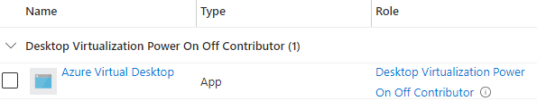

### Berechtigung {#fecdb63c0b41427da6b01b22664f12d1}

Um einen Skalierungsplan für AVD bereitzustellen, muss dem Dienstprinzipal von Azure Virtual Desktop die Rolle **Virtualization Power On Off Contributor** auf dem **Abonnement** zugewiesen werden.

| Dienstprinzipal                             | Anwendungs-ID                        |
| ------------------------------------------- | ------------------------------------ |
| Azure Virtual DesktopWindows Virtual Desktop | 9cdead84-a844-4324-93f2-b2e6bb768d07 |

Beispiel:

Quellen:

- [https://learn.microsoft.com/en-us/azure/virtual-desktop/autoscale-scaling-plan?WT.mc_id=Portal-HubsExtension&tabs=portal#assign-the-desktop-virtualization-power-on-off-contributor-role-with-the-azure-portal](https://learn.microsoft.com/en-us/azure/virtual-desktop/autoscale-scaling-plan?WT.mc_id=Portal-HubsExtension&tabs=portal#assign-the-desktop-virtualization-power-on-off-contributor-role-with-the-azure-portal)
- [https://learn.microsoft.com/en-us/azure/virtual-desktop/service-principal-assign-roles](https://learn.microsoft.com/en-us/azure/virtual-desktop/service-principal-assign-roles)
