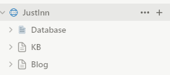
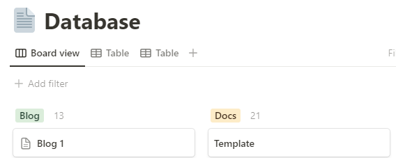

### Docs / Blog-Arbeitsablauf {#b0c1174de8314b718964b107f5a5e7ab}


GitHub Actions:


```json
    "pulldocs": "cross-var docu-notion -n %DOCU_NOTION_INTEGRATION_TOKEN% -r %DOCU_NOTION_DOCS_PAGE% -t \\"*\\" -m \\"./docs\\"",
    "pullblog": "cross-var docu-notion -n %DOCU_NOTION_INTEGRATION_TOKEN% -r %DOCU_NOTION_BLOG_PAGE% -t \\"*\\" -m \\"./blog\\""

```

- Eine einzelne Notion-Verbindung wird für den gesamten Workspace verwendet
- Der Workspace enthält eine Datenbank und zwei Root-Seiten für Dokumente und Blog




- Um nur die Dokumenten- oder Blog-Struktur abzurufen, verwenden wir die Seiten-ID von KB und Blog in der GitHub Action
- Wir überprüfen nicht den Datenbankstatus einer Seite
- Wir nutzen die Statusinformationen, um die Seiten zwischen Blog und Dokumenten zu unterscheiden

	


### Änderungen {#3df06882f0de4358adf0dcf174a1b559}


Wir haben die Notion-Mehrzeileneigenschaft **Frontmatter** eingeführt.


Die Zeichenkette wird zu den notionFrontmatterProperties hinzugefügt.


Auf diese Weise können wir jedes Frontmatter in docu-notion verwenden


Im Folgenden sind die Änderungen aufgeführt, die wir implementiert haben:

- [src/transform.ts](https://github.com/sillsdev/docu-notion/compare/main...JustInnIO:docu-notion:main#diff-adb065f7ea26f7f005649ad48bcbf0534bc860c701bb4e19c3917b125f4e2f20)

	```typescript
	  if (page.frontmatter) {
	    const notionFrontmatter = page.frontmatter;
	
	    const notionFromtmatterProperties = notionFrontmatter.split("\\n");
	
	    notionFromtmatterProperties.forEach(property => {
	      frontmatter += `${property}\\n`;
	    });
	  }
	
	```

- [src/NotionPage.ts](https://github.com/sillsdev/docu-notion/compare/main...JustInnIO:docu-notion:main#diff-240264b397a110805a81bbfc81e6fabc2ff9702703ffdf0c6d1af84edbb05622)

	```typescript
	  public get frontmatter(): string | undefined {
	    return this.getPlainTextProperty("Frontmatter", "");
	  }
	
	```


### NPM {#e4ac538cdbcf463bbe1fb5262c10d35c}


#### Übersicht {#a017adf1c16f433f8952a08910861ee1}

- Das Paket ist auf [npmjs.com](http://npmjs.com/) verfügbar [https://www.npmjs.com/package/@justinnio/docu-notion](https://www.npmjs.com/package/@justinnio/docu-notion)

#### Aktualisierungsprozess {#e15e4a9fc5984b789f55deba696cdcc8}


```powershell
# Installieren Sie die Abhängigkeiten
npm i

# Aktualisieren Sie die Versionsnummer in docu-notion
# Datei: <https://github.com/JustInnIO/docu-notion/blob/main/package.json>

# Führen Sie den Build aus
npm run build

# Melden Sie sich bei NPMjs.com an
npm adduser

# Veröffentlichen Sie die neue Version auf NPM
npm publish

# Aktualisieren Sie die Versionsnummer für die Website
# Datei: <https://github.com/JustInnIO/website/blob/master/package.json>

```


### Notion API Info {#3c4c2a6a312a40c3ab40c488df19e22e}


docu-notion nutzt [docu-notion/src/pull.ts at main · sillsdev/docu-notion (github.com)](https://github.com/sillsdev/docu-notion/blob/main/src/pull.ts) um Seiten von Notion abzurufen. Die Logik kann angepasst werden.


Mit der folgenden Funktion finden wir Seiten in Notion:


`await notionClient.pages.retrieve({ page_id: options.rootPage` });


Die GET-Funktion wird hier detailliert beschrieben:


[https://developers.notion.com/reference/retrieve-a-page](https://developers.notion.com/reference/retrieve-a-page)


Es ist möglich, eine Filtereigenschaft hinzuzufügen:


Der Filter wird im Body definiert.


**Beispiel**


```json
{
  "and": [
    {
      "property": "Approved",
      "checkbox": {
        "equals": true
      }
    },
    {
      "property": "Episodes",
      "select": {
        "equals": "React"
      }
    }
  ]
}
```
