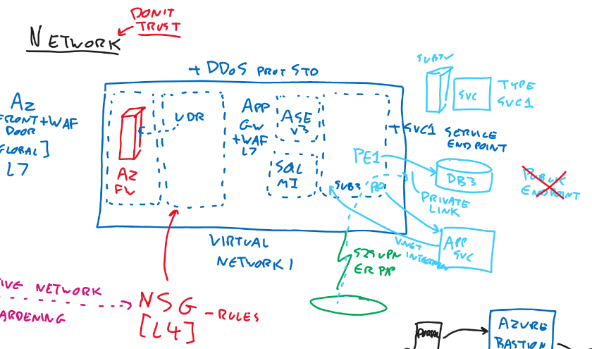
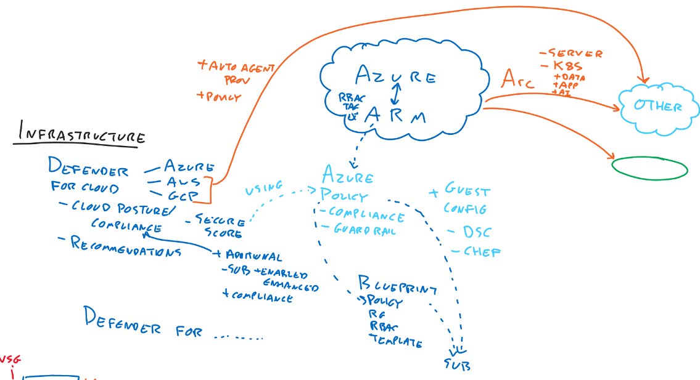
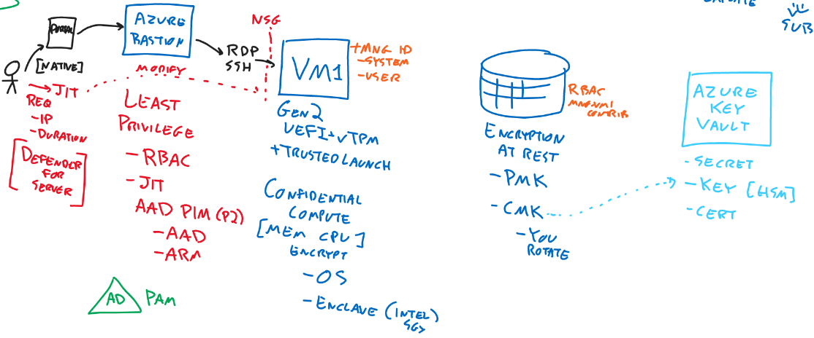

import ReactPlayer from "react-player";

**Video:**

<ReactPlayer controls url="https://www.youtube.com/watch?v=2Qu5gQjNQh4&list=PLlVtbbG169nHcbeVtWUfP8BeEjGniBJeb" />

**Resources**

- MS Cybersecurity Reference Architectures
[Microsoft Cybersecurity Reference Architectures - Security documentation | Microsoft Learn](https://learn.microsoft.com/en-us/security/cybersecurity-reference-architecture/mcra)
- Complete Whiteboard
[SC-100-Whiteboard.png (6133×3298) (raw.githubusercontent.com)](https://raw.githubusercontent.com/johnthebrit/CertificationMaterials/main/whiteboards/SC-100-Whiteboard.png)

**Overview**

- Full scope of all security solutions across Azure and M365
- What capabilities they bring
	- It’s not important how to implement them
- Which products are the best solution for what case

**Zero Trust**

1. Verify Explicitly
2. Use least privilege
3. Assume breach

### Identity {#07b123e704ce43e98a70e75d87fde23c}

- Identity Protection - P2
	- Signal of attack
- MFA
	- Included in P1
- Security Defaults
	- MFA available without P1 and P2 license
	- Conditional Access settings cant be changed
- Conditional Access - P1
	- Identity Protection risk uses Conditional Access
- Defender for Identity
	- Installs Agents on Domain controllers
	- Checks for compromises
	- Advanced Threat Protection in the past
- AAD Connect
	- Password Hash sync **recommended**
		- Can look for leaked credentials
- B2B (Partners)
	- Possible to add them as guests
	- MSA
	- Gmail
	- SAML
- Customers
	- We dont want customers in our AAD
	- We are using AAD B2C
		- Customer can use their social account in the B2C instance
		- We can also provide accounts
		- Its completely different from the normal AAD

### Endpoint {#ba6c47769d36456a9e03dceceb4f00f3}

- Possible Endpoints
	- Computers
	- Mobile
	- IoT
	- Printers
	- …
- Networks
	- Corporate
	- Internet
	- Private
- Steps
	- Register the devices to the AAD, to be known identities
		- Allows managing, for example with policies or track compliance
- Solutions
	- Microsoft Endpoint Manager
		- Intune
			- All about internet connected devices
			- Policy compliance information can be used in Conditional Access
			- Configuration
			- Inventory
		- Configuration Manager / Config Mgr
			- Devices on network
		- Co-Management
			- Both tools can be used
			- it can be decided which feature from cloud or onpremise
	- Defender for Endpoint
		- About
			- Protect
			- Detect
			- Respond
	- Defender for Servers
		- About
			- Adaptive App Hardening
				- It looks what normally run and builds an allowlist and stop unusual applications
				- File Integrity Monitoring (FIM)
					- Core os files, core application files
					- Stops changes

	## Network

	

	:::tip
	
	We don’t trust Network!
	
	:::
	
	

	Networks

	- Segmented
	- Network Security Groups (NSG) [Layer 4]
		- Rules
			- Ports, IP, Protocol, Action
		- Is being attached to vNets
		- Application Security Groups are attached to a NIC
			- Can checks for tags on the resource and apply different rules
		- Adaptive Network Hardening (**from Defender for Servers)**
			- Builds recommendation depending on what it has seen on the NSG
	- User Defined Routes (UDR)
	- Firewall
	- Azure Front Door
		- Global Service
		- L7
		- WAF can be added
	- Application Gateway
		- Regional
		- L7
		- WAF can be added
	- DDOS Standard can be added to a vNet for extra protection
	[Azure DDoS Protection Overview | Microsoft Learn](https://learn.microsoft.com/en-us/azure/ddos-protection/ddos-protection-overview)
	- Service Endpoint
		- Type Service1
		- A vNet can become a Service Endpoint object
	- Private Endpoint (part of Private Link service)
		- Can replace the public endpoint
	- vNet Integration
		- Makes it possible for a service to talk outbound directly with private IP addresses in Azure

### Infrastructure {#dbb8b9dbe3d94a5dab3881324394f46c}

- Solutions
	- Defender for Cloud (Azure Solution Center)
		- Cloud Posture
			- Compliance
				- More industry standards can be added
			- Secure Store
		- Recommendations
		- Can manage Azure Arc systems
	- Azure Policy
		- Compliance
		- Guard Rail
		- Guest config
			- Windows: DSC
			- Linux: Chef
	- Blueprint
		- Made of
			- policies
			- rbac
			- template
		- Can be assigned to subscriptions

		Encryption

		

		- PMK
		- CMK
			- Customer managed keys
			- You rotate
			- Azure Key Vault
				- Secret
				- Key
				- Cert
		- VM (Gen2)
			- UEFI+TPM
				- Trusted launch
			- Confidential Compute
				- MEM / CPU
					- encrypted
						- can be through OS or enclave (Intel)
			- Managed Identity can be added to resource
		- Least privilege
			- RBAC
			- Just in time
				- AAD PIM (P2) (Privileged Identity Management)
					- AAD
					- ARM
			- AD PAM (Privileged Access Managament)
		- Azure Bastion
			- Through portal or native tools like CLI or MSTSC
		- Just in time VM access
			- Feature of Defender for Server
			- Can be activated on VMs
			- Access needs to be requested in the Security Center
		- Azure Arc
			- Server
			- K8S
				- Data
				- App services
				- AI

### Signals {#cfd621a2fb404a17bc61fdd129f9d74d}

- Conditional Access
- Azure AD
	- Access package to get access (P2 feature)
- Defender for Cloud App
	- Reverse Proxy
	- Checks API traffic to see what user is doing
- DevOps
	- GitHub
		- Advanced Security
			- Converts code to data
			- Checks code for security risks
			- Can find secrets
	- Azure DevOps

### Data {#728aca256f4d4d838f15283f28c5cb10}

- Purview
	- Discover all data from all environments
	- Classify
		- Apply labels
			- Can be used for Information Protection
			- Protection
	- Lineage
- SQL DB
	- Discovery classifications
	- Data masking
- Azure Backup
	- PIN
	- MUA - Multi User Authentication
		- Resource Guard

### SIEM / SOAR {#4db1371417094531810150535a864547}

- Azure Sentinel
	- On top of Log Analytics Workspace
	- KQL - Query language
	- Collects
		- Collects data from systems by using connectors, for example:
			- Azure
			- AAD
			- M365
			- 3rd Party clouds
			- Syslogs / CEF
			- Custom
	- Detect
		- Analytics
			- Can run scheduled queries
			- Machine learning algorithm available
		- Hunting
			- Manual checks / queries
		- Intelligence
			- Feed
			- Can be mapped against logs
		- Leads to incident
	- Investigate
	- Respond
		- Automation
			- Automaton rules
				- Can run a Playbook
			- Playbooks
				- Uses Azure logic app
